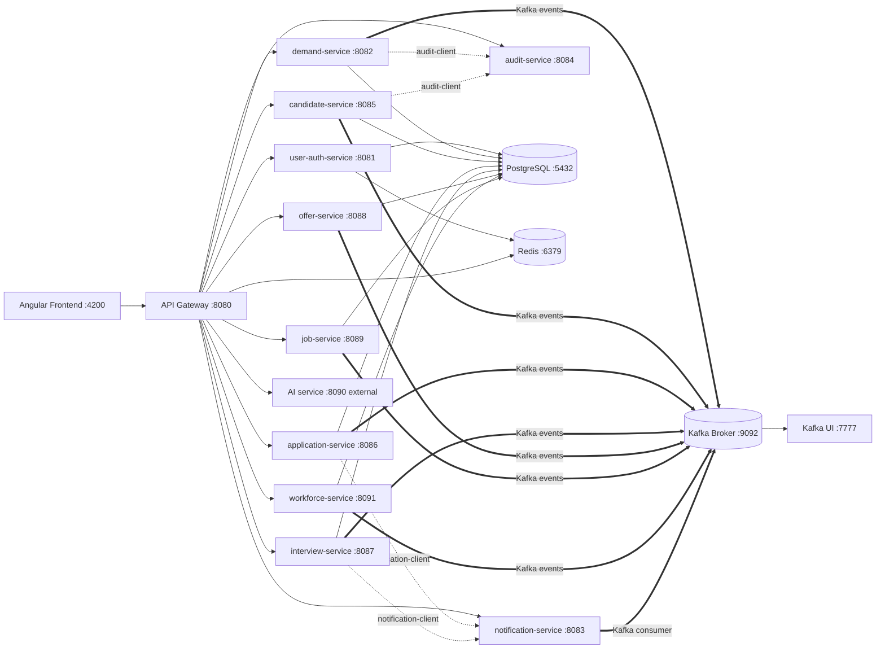

# Section 1: Submodules Integration

## 1. Title
Submodules Integration — How TalentGrid Services Communicate

## 2. Internship module requirement
Demonstrate understanding of how independently deployable services in a microservices system integrate with each other (sync and async), including dependency management and failure handling.

## 3. What was implemented in this project
- **Synchronous integration (frontend → backend)**: the Angular frontend talks only to the API Gateway (`:8080`). The gateway routes each request to the correct downstream service over plain HTTP using a static `host:port` from environment variables (see `rbac-rules.yml`/`application.yml` routes).
- **Synchronous integration (service → service)**: TalentGrid intentionally keeps this rare. The only real inter-service HTTP client code found is in `talentgrid-clients/`:
  - `audit-client` — a lightweight client used by services to write audit log entries (calls `talentgrid-audit-service`).
  - `notification-client` — used to trigger notifications (calls `talentgrid-notification-service`).
  - `auth-client` — **placeholder only** (`talentgrid-clients/auth-client/.gitkeep`), not yet implemented. Intended for direct calls into `user-auth-service` in the future.
- **Asynchronous integration (Kafka)**: the primary way domain services exchange business events. A shared `talentgrid-kafka` module provides `BaseKafkaConsumer` and event/producer scaffolding. Services like `demand-service`, `candidate-service`, `application-service`, `interview-service`, `offer-service`, `job-service`, `workforce-service`, and `talentgrid-notification-service` each have their own `*EventProducer` / `*EventTranslator` / Kafka consumer classes built on this shared base.
- **RestTemplate/WebClient/OpenFeign**: no direct `RestTemplate`/`WebClient` calls between domain services were found (aside from the `talentgrid-clients` Feign-style clients above). `services/workforce-service` does use a Feign client (`TalentGridFeignErrorDecoder`) for its own external AI calls.

## 4. If not implemented — status
`auth-client`: **Status: Proposed / Not yet implemented** — folder exists but is empty.

## 5. Why this is needed in microservices
Independently deployed services must have a clear, documented contract for how they depend on each other. Async (Kafka) integration decouples services in time and reduces cascading failures; direct HTTP calls (Feign/WebClient) are used only where a synchronous answer is required (e.g. audit logging, notifications). Knowing which style is used for which relationship is essential to reasoning about failure modes.

## 6. Architecture explanation — Mermaid diagram


## 7. Service dependency table
| Service | Depends on (sync) | Depends on (async/Kafka) | Depends on (infra) |
|---|---|---|---|
| API Gateway | all domain services (routing), Redis | — | Redis |
| user-auth-service | — | publishes user events | PostgreSQL, Redis, Kafka |
| demand-service | audit-client → audit-service | produces/consumes demand events | PostgreSQL, Redis, Kafka |
| candidate-service | audit-client → audit-service | produces/consumes candidate events | PostgreSQL, Redis, Kafka |
| application-service | notification-client → notification-service | produces/consumes application events | PostgreSQL, Redis, Kafka |
| interview-service | notification-client → notification-service | produces/consumes interview events | PostgreSQL, Redis, Kafka |
| offer-service | — | produces/consumes offer events | PostgreSQL, Redis, Kafka |
| job-service | — | produces portal events; calls external AI relay | PostgreSQL, Kafka |
| workforce-service | Feign client → external AI service | produces/consumes workforce events | PostgreSQL, Kafka |
| notification-service | — | consumes notification events | PostgreSQL, Kafka |
| audit-service | — | — | PostgreSQL |

## 8. API integration table
| Frontend/Gateway Path | Target Service | Style |
|---|---|---|
| `/api/v1/auth/**` | user-auth-service | Sync HTTP via gateway |
| `/api/v1/demands/**` | demand-service | Sync HTTP via gateway |
| `/api/v1/candidates/**` | candidate-service | Sync HTTP via gateway |
| `/api/v1/applications/**` | application-service | Sync HTTP via gateway |
| `/api/v1/interviews/**` | interview-service | Sync HTTP via gateway |
| `/api/v1/offers/**` | offer-service | Sync HTTP via gateway |
| `/api/v1/job-postings/**` | job-service | Sync HTTP via gateway |
| `/api/v1/engineers/**`, `/api/v1/rmg/**` | workforce-service | Sync HTTP via gateway |
| `/api/v1/notifications/**` | notification-service | Sync HTTP via gateway (read); Kafka (write triggers) |
| `/api/v1/audit/**` | audit-service | Sync HTTP via gateway (read); direct client (write) |
| `/api/v1/ai/**` | AI service (external, :8090) | Sync HTTP via gateway |

## 9. Dependency URLs / environment variables
All target hosts/ports are resolved from `.env` (see `.env.example`): `USER_AUTH_SERVICE_HOST/PORT`, `DEMAND_SERVICE_HOST/PORT`, `NOTIFICATION_SERVICE_HOST/PORT`, `AUDIT_SERVICE_HOST/PORT`, `CANDIDATE_SERVICE_HOST/PORT`, `APPLICATION_SERVICE_HOST/PORT`, `INTERVIEW_SERVICE_HOST/PORT`, `OFFER_SERVICE_HOST/PORT`, `JOB_SERVICE_HOST/PORT`, `AI_SERVICE_HOST/PORT`, `WORKFORCE_SERVICE_HOST/PORT`. Kafka: `KAFKA_BOOTSTRAP_SERVERS`. Redis: `REDIS_HOST`/`REDIS_PORT`. Database: `DB_HOST`, `POSTGRES_HOST_PORT`, `DB_NAME`.

## 10. Docker Compose service names
From root `docker-compose.yml`: `broker` (Kafka, KRaft mode), `kafka-ui`, `postgres` (pgvector/pgvector:pg16), `redis`. All backend Spring Boot services are currently expected to run outside Docker (via Maven/IDE), not as their own Compose services — there are per-service `Dockerfile`s (e.g. `talentgrid-api-gateway-service/Dockerfile`, `services/demand-service/Dockerfile`, `services/job-service/Dockerfile`) but they are not yet wired into `docker-compose.yml`.

## 11. Failure handling when a dependency is unavailable
- Gateway → service: HTTP client has `connect-timeout: 5000ms` and `response-timeout: 60s` (see `talentgrid-api-gateway-service/application.yml`), but **no circuit breaker or fallback is wired** (see `06-resilience-optional.md`). A downstream outage currently surfaces as a gateway timeout/502 to the frontend.
- Kafka consumers: `BaseKafkaConsumer.process()` catches exceptions and logs an error, but contains an explicit `// TODO: Route to dead-letter topic` and `// TODO: Emit failure metric` — **no DLQ or retry policy is implemented yet.** A failed event is currently just logged and dropped.
- `demand-service` AI calls: protected by a custom hand-rolled `SimpleCircuitBreaker` (see `06-resilience-optional.md`).

## 12. Local run commands
```bash
docker compose up -d
./mvnw -pl talentgrid-shared,talentgrid-kafka,talentgrid-clients/audit-client,talentgrid-clients/notification-client -am install -DskipTests
cd services/user-auth-service && ../../mvnw spring-boot:run
```

## 13. curl commands
```bash
curl -i http://localhost:8080/api/v1/demands/health/ping 2>/dev/null
curl -i http://localhost:8080/actuator/health
```

## 14. Swagger/Postman testing instructions
1. Start the gateway and the target service.
2. Open `http://localhost:<service-port>/swagger-ui/index.html` directly on the service (note: several services disable Swagger UI in non-dev profiles — check `springdoc.swagger-ui.enabled`).
3. Alternatively, import each service's OpenAPI JSON (`/v3/api-docs`) into Postman as a collection.

## 15. Screenshot checklist
- [ ] Kafka UI showing topics/messages produced by a service
- [ ] Gateway routing a request end-to-end (browser network tab or curl)
- [ ] A service log line showing correlation ID propagated from the gateway

`Screenshot: <ATTACH_SCREENSHOT_HERE>`

## 16. GitHub/MR link
`GitHub/MR Link: <PASTE_LINK_HERE>`

## 17. Troubleshooting
- "Connection refused" from the gateway usually means the target service isn't running on the port configured in `.env`.
- If Kafka events aren't consumed, verify `KAFKA_BOOTSTRAP_SERVERS` matches the broker's advertised listener (`localhost:9092` for host processes).

## 18. Mentor review checklist
- [ ] Dependency table matches actual gateway routes
- [ ] Kafka vs. HTTP integration style correctly attributed per service
- [ ] Failure-handling gaps (no DLQ, no circuit breaker) called out honestly

---
Back to: [00 Overview](00-module-8-overview.md) · Next: [02 Microservices Course Proof](02-microservices-course-proof.md)
