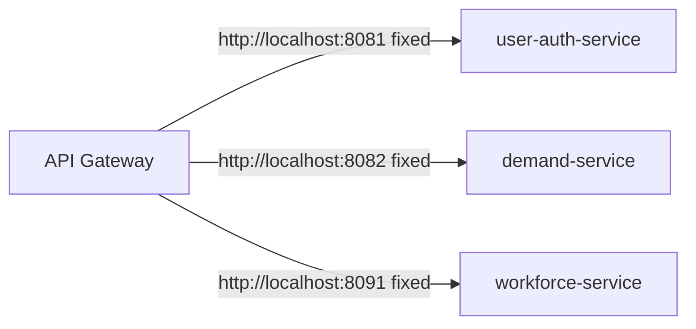
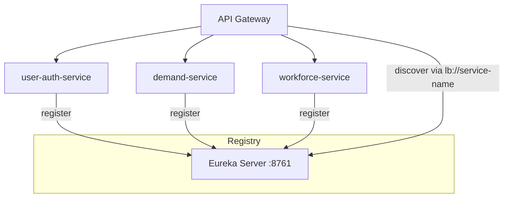

# Section 3: Service Discovery

## 1. Title
Service Discovery — Status and Proposed Implementation (Eureka)

## Status: Proposed / Not yet implemented

## 2. Internship module requirement
Demonstrate understanding of service discovery/registration so that services can find each other dynamically instead of via hardcoded addresses.

## 3. What was implemented in this project
**Nothing.** A full repository search for the following found zero matches:
- Eureka Server
- `@EnableEurekaServer`
- `spring-cloud-starter-netflix-eureka-server`
- `spring-cloud-starter-netflix-eureka-client`
- `eureka.client.service-url.defaultZone`

Every service is instead wired via static environment variables (e.g. `DEMAND_SERVICE_HOST`, `DEMAND_SERVICE_PORT`) that the API Gateway reads to build the target `uri` for each route (see `talentgrid-api-gateway-service/src/main/resources/rbac-rules.yml`, `routes:` section). This works today because exactly one instance of each service runs on a fixed port, but it does not scale to multiple instances or dynamic environments (Kubernetes, autoscaling).

## 4. Why service discovery is needed in microservices
Without a registry, adding a second instance of a service, moving a service to a new host, or running in an orchestrator that assigns dynamic IPs (Kubernetes pods) all require manual reconfiguration of every caller. A service registry (Eureka, Consul, or Kubernetes' own DNS/Service objects) lets services register themselves and lets callers resolve a logical name instead of a fixed address.

## 5. Architecture explanation (current, static)


## 6. Proposed architecture (with Eureka)


## 7. Proposed implementation plan
1. Add a new Maven module `talentgrid-eureka-server` with `spring-cloud-starter-netflix-eureka-server`.
2. Run it on port `8761`.
3. Add `spring-cloud-starter-netflix-eureka-client` to every domain service and the gateway.
4. Set `spring.application.name` per service (many already set this, e.g. gateway's `talentgrid-api-gateway-service`).
5. Point every service at `eureka.client.service-url.defaultZone`.
6. Change gateway route `uri:` values from `http://host:port` to `lb://<spring.application.name>`.
7. Add the Eureka server to `docker-compose.yml` (or run as its own Maven module locally).
8. Verify via the Eureka dashboard that all services show status `UP`.

## 8. Example Eureka Server config (proposed)
`application.yml` (new `talentgrid-eureka-server` module):
```yaml
server:
  port: 8761
spring:
  application:
    name: talentgrid-eureka-server
eureka:
  client:
    register-with-eureka: false
    fetch-registry: false
  server:
    enable-self-preservation: false
```
Main class:
```java
@SpringBootApplication
@EnableEurekaServer
public class EurekaServerApplication {
    public static void main(String[] args) {
        SpringApplication.run(EurekaServerApplication.class, args);
    }
}
```

## 9. Example Eureka Client config (proposed, per service)
```yaml
spring:
  application:
    name: demand-service
eureka:
  client:
    service-url:
      defaultZone: http://localhost:8761/eureka/
  instance:
    prefer-ip-address: true
```

## 10. Docker Compose snippet (proposed)
```yaml
  eureka-server:
    build: ./talentgrid-eureka-server
    container_name: talentgrid-eureka-server
    ports:
      - "8761:8761"
    networks:
      - talentgrid-network
```

## 11. Technologies used (proposed)
Spring Cloud Netflix Eureka (Server + Client).

## 12. Files inspected
Root `pom.xml`, every service `pom.xml`, every `application.properties`/`application.yml`, `talentgrid-api-gateway-service/src/main/resources/rbac-rules.yml`.

## 13. Files changed or to be changed
None changed. If implemented: new `talentgrid-eureka-server` module, root `pom.xml` (`<module>` entry), every service `pom.xml` (client dependency), every service config (client properties), gateway route `uri:` values, `docker-compose.yml`.

## 14. Configuration details
See config snippets above.

## 15. curl/dashboard verification (once implemented)
```bash
curl http://localhost:8761/eureka/apps
```
Or open `http://localhost:8761` in a browser to see the Eureka dashboard listing registered instances.

## 16. Local run commands (once implemented)
```bash
cd talentgrid-eureka-server && ../mvnw spring-boot:run
```

## 17. Screenshot checklist
- [ ] Eureka dashboard showing all services registered as `UP`
- [ ] Gateway route resolving via `lb://` instead of a fixed host:port

`Screenshot: <ATTACH_SCREENSHOT_HERE>`

## 18. GitHub/MR link
`GitHub/MR Link: <PASTE_LINK_HERE>`

## Troubleshooting
- If a service doesn't appear in Eureka, confirm `eureka.client.service-url.defaultZone` is reachable and `spring.application.name` is set.
- Self-preservation mode can hide down instances during local testing — disable it locally (`eureka.server.enable-self-preservation: false`).

## Mentor review checklist
- [ ] Confirms status is honestly marked "Proposed / Not yet implemented"
- [ ] Confirms proposed plan is technically sound and matches this project's actual service list
- [ ] If later implemented, confirms dashboard screenshot and MR link are attached

---
Back to: [00 Overview](00-module-8-overview.md) · Previous: [02 Microservices Course Proof](02-microservices-course-proof.md) · Next: [04 Load Balancing](04-load-balancing.md)
