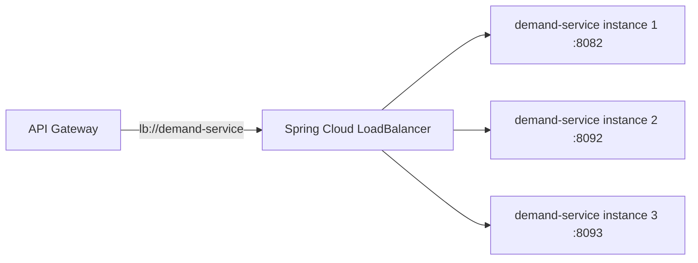

# Section 4: Load Balancing

## 1. Title
Load Balancing — Status and Proposed Implementation

## Status: Proposed / Not yet implemented

## 2. Internship module requirement
Demonstrate understanding of client-side load balancing across multiple instances of a service, rather than routing to a single hardcoded address.

## 3. What was implemented in this project
**Nothing.** A repository-wide search found no matches for:
- `spring-cloud-starter-loadbalancer`
- `@LoadBalanced`
- `DiscoveryClient`
- OpenFeign-based client load balancing

Every gateway route in `rbac-rules.yml` points at a single static `http://${SERVICE_HOST:localhost}:${SERVICE_PORT}` address. There is exactly one running instance of each service in this project, so load balancing has not been needed yet — but this also means the architecture cannot currently scale a service horizontally without manual gateway route changes.

## 4. Why load balancing is needed in microservices
Once a service runs as more than one instance (for scale or high availability), something must decide which instance handles each request. Client-side load balancing (resolving a logical service name to one of several healthy instances, e.g. round-robin) removes the need for a separate hardware/software load balancer per service and integrates naturally with service discovery.

## 5. Client-side load balancing concept
- The caller (gateway or another service) asks a "load balancer client" for an instance of `demand-service`.
- The load balancer client asks the service registry (Eureka — see `03-service-discovery.md`) for all currently registered, healthy instances of `demand-service`.
- It picks one (round-robin by default in Spring Cloud LoadBalancer) and sends the request there.
- If `demand-service` scales from 1 to 3 instances, no gateway config change is needed — the registry already has all 3.

## 6. Architecture explanation — Mermaid diagram (proposed)


## 7. Dependency example (proposed)
```xml
<dependency>
    <groupId>org.springframework.cloud</groupId>
    <artifactId>spring-cloud-starter-loadbalancer</artifactId>
</dependency>
```

## 8. `@LoadBalanced RestTemplate` example (proposed)
```java
@Configuration
public class RestTemplateConfig {
    @Bean
    @LoadBalanced
    public RestTemplate restTemplate() {
        return new RestTemplate();
    }
}
```
Usage:
```java
restTemplate.getForObject("http://demand-service/api/v1/demands/{id}", Demand.class, id);
```

## 9. WebClient example (proposed, matches gateway's reactive stack)
```java
@Bean
@LoadBalanced
public WebClient.Builder loadBalancedWebClientBuilder() {
    return WebClient.builder();
}
```

## 10. Gateway route change (proposed, once Eureka + LoadBalancer are added)
```yaml
- id: demand-service
  uri: lb://demand-service
  predicates:
    - "Path=/api/v1/demands/**"
```
This replaces the current static `http://${DEMAND_SERVICE_HOST:localhost}:${DEMAND_SERVICE_PORT:8082}`.

## 11. Docker Compose scaling example (proposed)
```bash
docker compose up -d --scale demand-service=3
```
(Requires `demand-service` to be defined as a Compose service first — currently it is not; see `01-submodules-integration.md` section 10.)

## 12. Verification using logs (proposed)
Round-robin behavior can be confirmed by tailing each instance's log and observing that requests alternate between instances:
```bash
docker compose logs -f demand-service
```

## 13. curl verification (proposed)
```bash
for i in 1 2 3 4 5 6; do curl -s http://localhost:8080/api/v1/demands/1 -o /dev/null -w "%{http_code}\n"; done
```
Then compare which instance's log picked up each request.

## 14. Technologies used (proposed)
Spring Cloud LoadBalancer (client-side, round-robin by default), paired with Eureka for instance discovery.

## 15. Files inspected
Every service `pom.xml`, `talentgrid-api-gateway-service/src/main/resources/rbac-rules.yml` and `application.yml`.

## 16. Files changed or to be changed
None changed. If implemented: gateway `pom.xml` + route `uri` values, `docker-compose.yml` (to support `--scale`).

## 17. Screenshot checklist
- [ ] Multiple service instance logs showing alternating requests
- [ ] Gateway route config showing `lb://` scheme

`Screenshot: <ATTACH_SCREENSHOT_HERE>`

## 18. GitHub/MR link
`GitHub/MR Link: <PASTE_LINK_HERE>`

## Troubleshooting
- `lb://` URIs only resolve once both Eureka and Spring Cloud LoadBalancer are on the classpath and the target service is registered — otherwise the gateway returns `503 Service Unavailable`.

## Mentor review checklist
- [ ] Confirms status honestly marked "Proposed / Not yet implemented"
- [ ] Confirms this depends on Service Discovery (`03-service-discovery.md`) being implemented first
- [ ] Confirms round-robin behavior evidence (once implemented) is real logs, not assumed

---
Back to: [00 Overview](00-module-8-overview.md) · Previous: [03 Service Discovery](03-service-discovery.md) · Next: [05 API Gateway](05-api-gateway.md)
