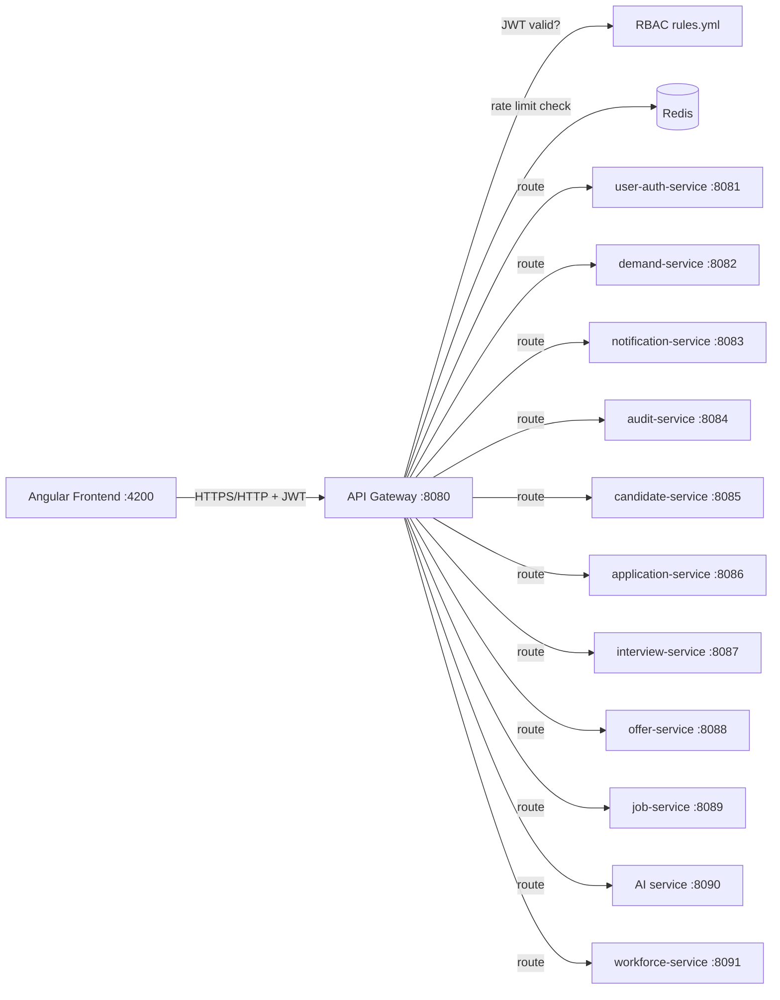

# Section 5: API Gateway

## 1. Title
API Gateway — Real Implementation (Spring Cloud Gateway)

## Status: Implemented

## 2. Internship module requirement
Demonstrate a single entry point for the frontend that handles routing, cross-cutting concerns (CORS, auth, rate limiting), and hides internal service topology.

## 3. What was implemented in this project
`talentgrid-api-gateway-service` is a real, working **Spring Cloud Gateway** (WebFlux/reactive), not Nginx and not a custom hand-written proxy. Verified from `talentgrid-api-gateway-service/src/main/resources/application.yml` and `rbac-rules.yml`:
- Runs on port **8080** (`server.port: ${API_GATEWAY_PORT:8080}`).
- Declarative routing (~50 routes) mapping frontend paths to 9 downstream services, using `Path` predicates and `RewritePath` filters (many routes support both `/api/v1/...` and a friendlier `/talentgrid/...` alias).
- CORS is configured centrally (`spring.cloud.gateway.server.webflux.globalcors`), restricted to `http://localhost:4200` by default (the Angular dev server) via `CORS_ALLOWED_ORIGIN_PATTERNS`.
- Redis-backed rate limiting (`RequestRateLimiter` filter + `redis-rate-limiter` token bucket, configurable via `RATE_LIMIT_REPLENISH`/`RATE_LIMIT_BURST`/`RATE_LIMIT_TOKENS`), keyed per-user via a custom `userKeyResolver` bean.
- JWT authentication is centralized at the gateway (`jwt.secret: ${JWT_SECRET}`), with a custom RBAC layer defined declaratively in `rbac-rules.yml` (public paths + per-path/method `allowed-scopes`/`allowed-roles`).
- Header hygiene: `DedupeResponseHeader` filter prevents duplicate CORS headers when a downstream service also sets them; a `SecureHeaders` filter adds standard security headers.
- Correlation ID and trace ID propagation via custom `CorrelationIdFilter` and `TraceContextFilter` (see `08-logs.md`, `10-traces.md`).
- Actuator exposed at `health,info,metrics,prometheus`.

## 4. If not implemented
Not applicable — the gateway itself is implemented. Sub-parts not implemented: Resilience4j wiring (see `06-resilience-optional.md`), Eureka-based dynamic routing (see `03-service-discovery.md`).

## 5. Why this is needed in microservices
A gateway gives the frontend one stable URL and hides the internal service topology, so services can be renamed, moved, or split without the frontend changing. It's also the natural place to enforce cross-cutting concerns (auth, rate limiting, CORS) once instead of duplicating them in every service (though this project still duplicates JWT validation in each service too — see `07-web-security.md`).

## 6. Architecture explanation — Mermaid diagram


## 7. Route table (representative sample — full list has ~50 routes in `rbac-rules.yml`/`application.yml`)
| Frontend Path | Gateway Route | Target Service | Purpose |
|---|---|---|---|
| `/api/v1/auth/**`, `/talentgrid/auth/**` | `user-auth-service` | user-auth-service :8081 | Login/register/refresh |
| `/api/v1/admin/**` | `user-auth-admin` | user-auth-service :8081 | Admin user/role management |
| `/api/v1/demands/**` | `demand-service` | demand-service :8082 | Demand lifecycle |
| `/api/v1/notifications/**` | `notification-service` | notification-service :8083 | Notifications |
| `/api/v1/audit/**` | `audit-service` | audit-service :8084 | Audit log read |
| `/api/v1/candidates/**` | `candidate-service` | candidate-service :8085 | Candidate management |
| `/api/v1/applications/**` | `application-service` | application-service :8086 | Hiring pipeline |
| `/api/v1/interviews/**` | `interview-service` | interview-service :8087 | Interview scheduling |
| `/api/v1/offers/**` | `offer-service` | offer-service :8088 | Offer management |
| `/api/v1/job-postings/**`, `/api/v1/careers/**` | `job-service`, `careers-portal` | job-service :8089 | Job posting + careers portal |
| `/api/v1/ai/**` | `ai-service` | AI service :8090 (external) | AI relay |
| `/api/v1/engineers/**`, `/api/v1/rmg/**`, `/api/v1/utilisation/**` | multiple workforce routes | workforce-service :8091 | Workforce/bench management |

## 8. CORS
```yaml
globalcors:
  add-to-simple-url-handler-mapping: false
  cors-configurations:
    "[/**]":
      allowed-origin-patterns: ${CORS_ALLOWED_ORIGIN_PATTERNS:http://localhost:4200}
      allowed-methods: "*"
      allowed-headers: "*"
      exposed-headers: "*"
      allow-credentials: true
      max-age: 3600
```

## 9. Authentication/JWT filter
JWT secret is injected as `jwt.secret: ${JWT_SECRET}` and validated per-request before RBAC rules are applied. Public paths bypass JWT entirely (see `rbac-rules.yml`: `/api/v1/auth/**`, `/oauth2/**`, `/actuator/health`, `/actuator/info`, careers/public job listing endpoints, etc.). Full flow documented in `07-web-security.md`.

## 10. RBAC
Enforced via `talentgrid-api-gateway-service/src/main/resources/rbac-rules.yml` — a declarative `path` + `methods` → `allowed-scopes`/`allowed-roles` table covering all 6 teams' endpoints (~150 rules). This is a genuinely substantial, real implementation, not a stub.

## 11. Health
`/actuator/health`, `/actuator/info` are public (listed in `rbac-rules.yml` public-paths). `management.endpoint.health.show-details: always`.

## 12. Swagger limitations
The gateway itself does not aggregate Swagger UIs from downstream services (no `springdoc` route aggregation config found). Each service exposes its own `/v3/api-docs` and `/swagger-ui/index.html` directly on its own port — there is no single combined Swagger UI reachable through the gateway.

## 13. Docker/local gateway URL
Local: `http://localhost:8080`. `talentgrid-api-gateway-service/Dockerfile` exists but the gateway is not yet added as a service in root `docker-compose.yml`.

## 14. Technologies used
Spring Cloud Gateway (WebFlux), Spring Data Redis (rate limiting), JJWT, Micrometer + Prometheus, Micrometer Tracing (OTel bridge), springdoc-openapi (WebFlux variant).

## 15. Files inspected
`talentgrid-api-gateway-service/pom.xml`, `src/main/resources/application.yml`, `src/main/resources/rbac-rules.yml`, `src/main/java/.../filter/*.java`, `README.md`, `API permissions.md`.

## 16. Files changed or to be changed
None — this section documents existing, working code.

## 17. Configuration details
Key env vars: `API_GATEWAY_PORT` (8080), `CORS_ALLOWED_ORIGIN_PATTERNS`, `RATE_LIMIT_REPLENISH`/`RATE_LIMIT_BURST`/`RATE_LIMIT_TOKENS`, `JWT_SECRET`, `REDIS_HOST`/`REDIS_PORT`, and one `*_HOST`/`*_PORT` pair per downstream service.

## 18. Docker Compose changes
None made. The gateway is not currently in `docker-compose.yml`; running it as a Compose service (using its existing `Dockerfile`) is a reasonable next step but out of scope for this documentation pass.

## Local run commands
```bash
docker compose up -d
cd talentgrid-api-gateway-service && ../mvnw spring-boot:run
```

## Verification / curl commands
```bash
curl http://localhost:8080/actuator/health
curl -i http://localhost:8080/api/v1/auth/login -X POST -H "Content-Type: application/json" -d '{"email":"user@example.com","password":"changeme"}'
```

## Expected output
`/actuator/health` → `200 OK`. Login without valid credentials → `401 Unauthorized`.

## Screenshot checklist
- [ ] Gateway startup log showing all ~50 routes loaded
- [ ] Successful request routed through the gateway to a downstream service
- [ ] Rate-limit headers visible in a response (`X-RateLimit-Remaining`, etc.)

`Screenshot: <ATTACH_SCREENSHOT_HERE>`

## GitHub/MR link
`GitHub/MR Link: <PASTE_LINK_HERE>`

## Troubleshooting
- `403`/CORS errors from the Angular app usually mean `CORS_ALLOWED_ORIGIN_PATTERNS` doesn't match the frontend origin exactly.
- Duplicate `Access-Control-Allow-Origin` headers indicate a downstream service is also setting CORS headers — the `DedupeResponseHeader` filter should catch this, but confirm the downstream service isn't also enabling permissive CORS.

## Mentor review checklist
- [ ] Route table matches the real `rbac-rules.yml`
- [ ] Confirms CORS, rate limiting, and JWT are genuinely wired (not just present as dependencies)
- [ ] Confirms Swagger aggregation limitation is accurately described

---
Back to: [00 Overview](00-module-8-overview.md) · Previous: [04 Load Balancing](04-load-balancing.md) · Next: [06 Resilience (Optional)](06-resilience-optional.md)
