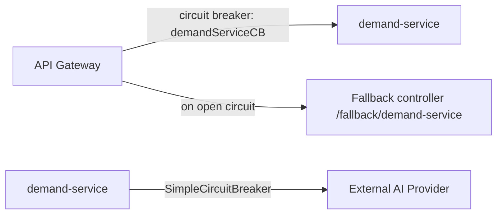

# Section 6: Resilience (Optional)

## 1. Title
Resilience Patterns — Partial Status (Resilience4j dependency present, not wired; custom circuit breaker in demand-service)

## Status: Partial / Optional — dependency added but not actively used; one custom (non-Resilience4j) implementation exists

## 2. Internship module requirement
(Optional module) Demonstrate awareness of resilience patterns — circuit breaker, retry, timeout, fallback — for calls to unreliable dependencies.

## 3. What was implemented in this project
- `talentgrid-api-gateway-service/pom.xml` includes `spring-cloud-starter-circuitbreaker-reactor-resilience4j` as a dependency. **However, no `@CircuitBreaker`, `@Retry`, `@TimeLimiter` annotation, fallback method, or `resilience4j.*` configuration was found anywhere in the gateway's Java code or `application.yml`.** The dependency is on the classpath but not actually used.
- `services/demand-service/src/main/java/com/talentgrid/demand/ai/SimpleCircuitBreaker.java` is a **hand-rolled circuit breaker** (not Resilience4j) used by `AiTextGenerationOrchestrator` and `AiEmbeddingOrchestrator` to protect calls to external AI providers. It tracks `consecutiveFailures` against a `failureThreshold`, and once tripped stays "open" for a configurable `Duration` before resetting — the same conceptual pattern as Resilience4j's circuit breaker, implemented manually instead of via the library.
- The gateway's HTTP client has `connect-timeout: 5000ms` and `response-timeout: 60s` configured (a basic timeout, not a full timeout+fallback pattern).
- Kafka consumers have no retry/backoff — a failed event is logged and dropped (see `01-submodules-integration.md` section 11).

## 4. If not implemented
`Status: Optional / Proposed` for: gateway-level Resilience4j circuit breakers/retries/fallbacks on calls to downstream services, and a Kafka retry/DLQ policy.

## 5. Why this is needed in microservices
When one service is slow or down, calls to it can pile up threads/connections in the caller and cascade the failure outward. Circuit breakers stop calling a failing dependency for a cooldown period and return a fast, defined fallback instead of hanging; retries handle transient blips; timeouts bound how long a caller waits.

## 6. Circuit breaker (existing custom implementation)
```java
public class SimpleCircuitBreaker {
    private final int failureThreshold;
    private final Duration openDuration;
    private int consecutiveFailures;
    private Instant openedAt;

    public boolean isOpen() {
        if (openedAt == null) return false;
        if (Instant.now().isAfter(openedAt.plus(openDuration))) {
            openedAt = null; consecutiveFailures = 0; return false;
        }
        return true;
    }
    public void recordSuccess() { consecutiveFailures = 0; openedAt = null; }
    public void recordFailure() {
        consecutiveFailures++;
        if (consecutiveFailures >= failureThreshold) openedAt = Instant.now();
    }
}
```
This is used per-AI-provider in `demand-service` before making an outbound AI call, and records success/failure after each attempt.

## 7. Proposed: wiring Resilience4j at the gateway (dependency already present)
Dependency (already in `talentgrid-api-gateway-service/pom.xml`):
```xml
<dependency>
    <groupId>org.springframework.cloud</groupId>
    <artifactId>spring-cloud-starter-circuitbreaker-reactor-resilience4j</artifactId>
</dependency>
```
Proposed config (`application.yml`):
```yaml
resilience4j:
  circuitbreaker:
    instances:
      demandServiceCB:
        sliding-window-size: 10
        failure-rate-threshold: 50
        wait-duration-in-open-state: 10s
  timelimiter:
    instances:
      demandServiceCB:
        timeout-duration: 3s
```
Proposed gateway route filter:
```yaml
filters:
  - name: CircuitBreaker
    args:
      name: demandServiceCB
      fallbackUri: forward:/fallback/demand-service
```
Proposed fallback controller:
```java
@RestController
public class FallbackController {
    @GetMapping("/fallback/demand-service")
    public ResponseEntity<Map<String, String>> demandFallback() {
        return ResponseEntity.status(503)
            .body(Map.of("error", "demand-service temporarily unavailable"));
    }
}
```

## 8. Java annotation example (proposed, for a plain service-to-service call)
```java
@CircuitBreaker(name = "auditClient", fallbackMethod = "auditFallback")
@Retry(name = "auditClient")
public void writeAuditLog(AuditLogPayload payload) {
    auditLogClient.send(payload);
}

private void auditFallback(AuditLogPayload payload, Throwable t) {
    log.warn("Audit service unavailable, dropping/queueing audit log: {}", payload, t);
}
```

## 9. Architecture explanation — Mermaid diagram


## 10. curl test by stopping a dependency (proposed verification)
```bash
# Stop demand-service, then:
curl -i http://localhost:8080/api/v1/demands/1
# Expected today: gateway timeout/502 after up to 60s (no circuit breaker)
# Expected once implemented: fast 503 with fallback JSON body after circuit trips
```

## 11. Expected fallback response (once implemented)
```json
{ "error": "demand-service temporarily unavailable" }
```
HTTP status `503 Service Unavailable`.

## 12. AI service calls
`demand-service`'s `SimpleCircuitBreaker` already protects AI provider calls today — this is real, working code, just not built on Resilience4j.

## 13. Notification service calls
No resilience wrapper found around `notification-client` usage — a slow/down `notification-service` currently blocks the caller until the HTTP client's own default timeout.

## 14. Technologies used
Existing: hand-rolled Java (`SimpleCircuitBreaker`). Proposed: Resilience4j (`spring-cloud-starter-circuitbreaker-reactor-resilience4j`, already a gateway dependency).

## 15. Files inspected
`talentgrid-api-gateway-service/pom.xml`, `services/demand-service/src/main/java/com/talentgrid/demand/ai/SimpleCircuitBreaker.java`, `AiTextGenerationOrchestrator.java`, `AiEmbeddingOrchestrator.java`, `talentgrid-kafka/.../BaseKafkaConsumer.java`.

## 16. Files changed or to be changed
None changed. If implemented: gateway `application.yml` (resilience4j config + route filters), a new `FallbackController`.

## 17. Screenshot checklist
- [ ] Log showing `SimpleCircuitBreaker` opening after repeated AI provider failures
- [ ] (Once implemented) Gateway returning a fast fallback response with the dependency stopped

`Screenshot: <ATTACH_SCREENSHOT_HERE>`

## 18. GitHub/MR link
`GitHub/MR Link: <PASTE_LINK_HERE>`

## Troubleshooting
- If a fallback route never triggers, confirm the Resilience4j `TimeLimiter` duration is shorter than the caller's own HTTP timeout — otherwise the caller times out first.

## Mentor review checklist
- [ ] Confirms `SimpleCircuitBreaker` is accurately described as custom, not Resilience4j
- [ ] Confirms the Resilience4j dependency-without-usage gap is called out honestly
- [ ] Confirms proposed config is plausible for this project's actual gateway route structure

---
Back to: [00 Overview](00-module-8-overview.md) · Previous: [05 API Gateway](05-api-gateway.md) · Next: [07 Web Security](07-web-security.md)
