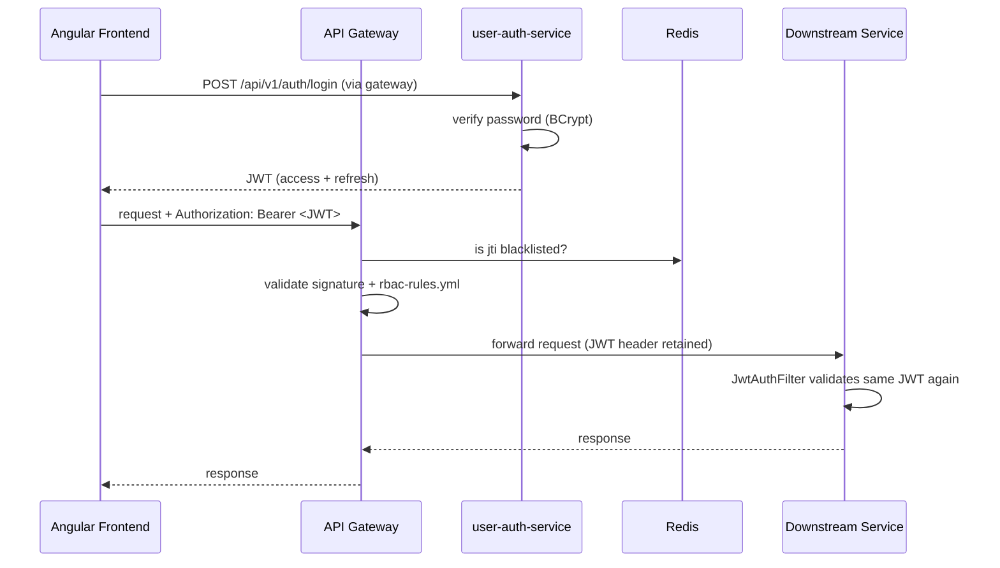

# Section 7: Web Security

## 1. Title
Web Security — JWT, RBAC, and Spring Security (Real Implementation)

## Status: Implemented

## 2. Internship module requirement
Demonstrate authentication and authorization across microservices: who can call what, and how identity is established and verified.

## 3. What was implemented in this project
- **Authentication**: `user-auth-service` issues JWTs (HS256) from `POST /api/v1/auth/login`, `POST /api/v1/auth/register`, `POST /api/v1/auth/oauth/token` (Google OAuth2 exchange), `POST /api/v1/auth/refresh`, and revokes them on `POST /api/v1/auth/logout`.
- **Password encoding**: `PasswordConfig.java` defines a `BCryptPasswordEncoder` bean, used by `AuthServiceImpl`/`AdminUserServiceImpl` — passwords are not stored in plain text.
- **Google OAuth2 login**: `GoogleOAuthLoginService.java` exists — social login is a real feature, not just JWT.
- **Token revocation**: `JwtBlacklistService` (gateway) stores blacklisted JWT `jti` values in Redis (`AppConstants.REDIS_BLACKLIST_PREFIX`), consulted on logout so a revoked token can't be reused even before it naturally expires.
- **Centralized authorization**: the gateway is the single authorization checkpoint. `rbac-rules.yml` defines public paths (skip JWT entirely) and, for every other path+method, either `allowed-scopes` or `allowed-roles` required in the JWT claims.
- **Defense in depth**: every downstream service *also* runs its own `SecurityConfig` + `JwtAuthFilter` that independently validates the same shared `JWT_SECRET` (confirmed in `user-auth-service`, `demand-service`, `candidate-service`, `application-service`, `interview-service`, `offer-service`, `job-service`, `workforce-service`) — so a request that somehow bypassed the gateway would still be rejected by the service itself.
- **Shared secret**: all services validate the same `JWT_SECRET` value (documented explicitly in several service READMEs, e.g. `talentgrid-shared/README.md`, `services/workforce-service/README.md`).

## 4. If not implemented
Not applicable to the core flow. **Not implemented**: mutual TLS between services, API keys for service-to-service calls (currently relies on shared-secret JWT validation only), a proper secrets manager (currently `.env` file + defaults baked into `application.properties` as fallback values — acceptable for local dev, flagged as a production risk in several service READMEs already).

## 5. Why this is needed in microservices
In a single monolith, a session can live in one process's memory. Across independently deployable services, identity has to travel with the request (a signed JWT) and every service (or a trusted gateway) must be able to verify it without a shared session store. RBAC at the edge (gateway) keeps authorization logic in one place instead of scattered ad hoc checks in every controller.

## 6. Security architecture diagram


## 7. Role/scope access matrix (excerpt — full list in `rbac-rules.yml`, ~150 rules)
| Path | Method | Required scope/role |
|---|---|---|
| `/api/v1/admin/users` | GET | `USER_VIEW` |
| `/api/v1/admin/users` | POST | `USER_CREATE` |
| `/api/v1/accounts` | POST | role `ADMIN` |
| `/api/v1/demands` | POST | `DEMAND_VIEW`, `DEMAND_CREATE`, `DEMAND_UPDATE` |
| `/api/v1/demands/**/approve` | POST | `DEMAND_PM_APPROVE` |
| `/api/v1/candidates` | POST | `CANDIDATE_CREATE` |
| `/api/v1/offers/**/approve` | PATCH/PUT | `OFFER_UPDATE`, `OFFER_APPROVE` |
| `/api/v1/job-postings/**/publish` | POST | `JOB_POSTING_PUBLISH` |
| `/api/v1/engineers` | POST | `ENGINEER_CREATE` |
| `/api/v1/gdpr/candidates/**/delete` | POST | `GDPR_DELETE` |

## 8. Endpoint security table
| Endpoint pattern | Public or Protected |
|---|---|
| `/api/v1/auth/**` | Public (login/register/refresh) |
| `/oauth2/**`, `/login/**` | Public (OAuth2 flow) |
| `/actuator/health`, `/actuator/info` | Public |
| `/api/v1/careers/**`, `/api/v1/branding` (GET) | Public (careers portal) |
| `/api/v1/job-postings/public/**` | Public |
| Everything else under `/api/v1/**` | Protected — requires valid JWT + matching scope/role |

## 9. JWT flow
1. Client calls `/api/v1/auth/login` with credentials.
2. `user-auth-service` verifies the BCrypt hash, issues a signed JWT (HS256, claims include user id, roles, scopes).
3. Client sends the JWT as `Authorization: Bearer <token>` on every subsequent request.
4. Gateway checks the Redis blacklist, verifies signature/expiry, then checks `rbac-rules.yml` for the requested path+method.
5. Downstream service independently re-validates the same JWT (its own `JwtAuthFilter`).
6. Logout blacklists the token's `jti` in Redis until natural expiry.

## 10. curl commands
```bash
# Register
curl -i -X POST http://localhost:8080/api/v1/auth/register \
  -H "Content-Type: application/json" \
  -d '{"email":"test@example.com","password":"ChangeMe123!","name":"Test User"}'

# Login
curl -i -X POST http://localhost:8080/api/v1/auth/login \
  -H "Content-Type: application/json" \
  -d '{"email":"test@example.com","password":"ChangeMe123!"}'

# Protected endpoint WITHOUT token
curl -i http://localhost:8080/api/v1/demands

# Protected endpoint WITH token
curl -i http://localhost:8080/api/v1/demands \
  -H "Authorization: Bearer <ACCESS_TOKEN_FROM_LOGIN>"
```

## 11. Expected status codes
| Scenario | Expected status |
|---|---|
| Successful register/login | `200` or `201` |
| Protected endpoint, no token | `401 Unauthorized` |
| Protected endpoint, valid token but missing scope/role | `403 Forbidden` |
| Protected endpoint, valid token + correct scope | `200 OK` |

## 12. Technologies used
Spring Security, JJWT (HS256), Spring Data Redis (blacklist), BCrypt, Spring OAuth2 Client (Google login).

## 13. Files inspected
`services/user-auth-service/src/main/java/.../config/SecurityConfig.java`, `PasswordConfig.java`, `controller/AuthController.java`, `oauth/GoogleOAuthLoginService.java`; `talentgrid-api-gateway-service/src/main/java/.../security/JwtBlacklistService.java`, `rbac-rules.yml`; per-service `SecurityConfig.java`/`JwtAuthFilter.java` in `demand`, `candidate`, `application`, `interview`, `offer`, `job`, `workforce` services; `talentgrid-shared/README.md`.

## 14. Files changed or to be changed
None — this documents existing, working security code. `JWT_SECRET` value itself is never reproduced in this document (see below).

## 15. Configuration details
`JWT_SECRET` — replaced everywhere in this documentation with the placeholder `<JWT_SECRET>`. Several services ship a **non-production fallback default** directly in `application.properties` (e.g. `jwt.secret=${JWT_SECRET:<JWT_SECRET>}`) — this is convenient for local dev but must always be overridden with a real secret outside local development.

## Docker Compose changes
None. Redis (used for the blacklist) is already defined in `docker-compose.yml`.

## Local run commands
```bash
docker compose up -d
cd services/user-auth-service && ../../mvnw spring-boot:run
cd talentgrid-api-gateway-service && ../mvnw spring-boot:run
```

## Screenshot checklist
- [ ] Successful login response (with JWT redacted/blurred)
- [ ] `401` on a protected endpoint without a token
- [ ] `403` on a protected endpoint with a token lacking the required scope
- [ ] `200` on a protected endpoint with the correct scope

`Screenshot: <ATTACH_SCREENSHOT_HERE>`

## GitHub/MR link
`GitHub/MR Link: <PASTE_LINK_HERE>`

## Troubleshooting
- `JWT signature does not match` — `JWT_SECRET` differs between services; it must be identical everywhere (documented in multiple service READMEs already).
- Token appears valid but request still gets `401` — check Redis; the token's `jti` may have been blacklisted by a prior logout.

## Mentor review checklist
- [ ] Confirms no real secret value appears anywhere in this file
- [ ] Confirms endpoint/scope table matches actual `rbac-rules.yml`
- [ ] Confirms 401 vs 403 behavior was actually tested, not assumed

---
Back to: [00 Overview](00-module-8-overview.md) · Previous: [06 Resilience (Optional)](06-resilience-optional.md) · Next: [08 Logs](08-logs.md)
