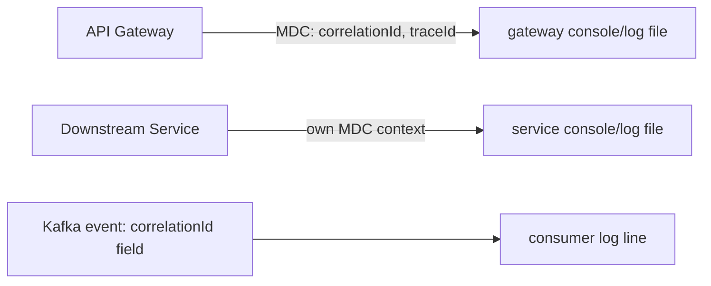
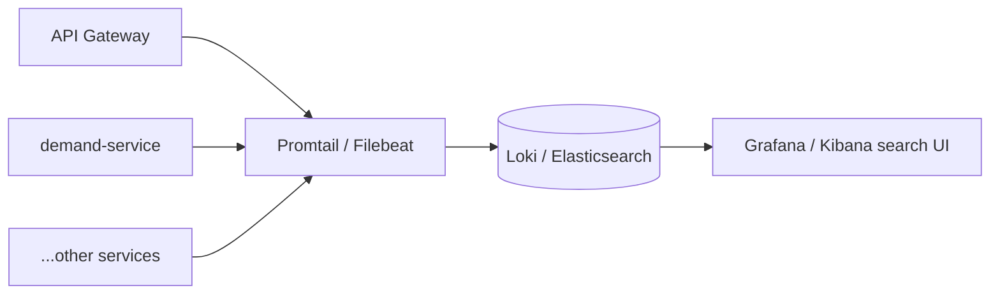

# Section 8: Logs

## 1. Title
Logging — Current Setup and Proposed Centralized Logging (ELK/Loki)

## Status: Partial — application logging works; structured JSON logging and centralized aggregation are proposed

## 2. Internship module requirement
Demonstrate that logs from multiple services can be produced with useful context (levels, correlation IDs) and, ideally, aggregated centrally for troubleshooting across services.

## 3. What was implemented in this project
- **Per-service logging**: every service uses default Spring Boot SLF4J/Logback console logging. No custom `logback-spring.xml` was found in any module, so log format is the default Spring Boot pattern (timestamp, level, logger, message), not JSON.
- **`logstash-logback-encoder` dependency**: declared in the root `pom.xml` dependency management (version 7.4) and pulled into the gateway and `talentgrid-notification-service` `pom.xml` files. **This dependency is present but not activated** — activating it requires a `logback-spring.xml` configuring the `net.logstash.logback.encoder.LogstashEncoder`, which does not exist yet. Today, output is still plain text, not JSON.
- **Correlation ID**: real, working. `CorrelationIdFilter` (gateway) generates or forwards an `X-Correlation-Id`-style header, puts it into SLF4J's `MDC`, and removes it once the request completes. `BaseEvent` (shared Kafka event base class) also carries a `correlationId` field, and `BaseKafkaConsumer` logs it on every event it processes — so correlation IDs are propagated end-to-end across HTTP and Kafka.
- **Trace ID**: `TraceContextFilter` (gateway) also injects the current Micrometer/OTel trace ID into MDC (see `10-traces.md`).
- **Local log files**: a `logs/` directory at the repo root already contains real, non-empty log files captured from prior local runs (`api-gateway.log`, `demand-service.log`, `user-auth-service.log`, and 8 others) — evidence this system has actually been run end-to-end locally.
- **Log levels**: gateway `application.yml` sets `com.talentgrid.gateway: DEBUG` and `org.springframework.cloud.gateway: INFO` explicitly; other services use Spring Boot defaults (`INFO`) unless overridden.

## 4. If not implemented — status
- **Structured JSON logging (activating logstash-logback-encoder)**: `Status: Proposed / Not yet implemented`.
- **Centralized log aggregation (ELK — Elasticsearch, Logstash, Kibana, or the scaffolded Grafana Loki)**: `Status: Proposed / Not yet implemented`. An `observability/loki/` folder exists in the repo but only contains a `.gitkeep` placeholder — no Loki config, no Promtail, no Docker Compose service.

## 5. Why this is needed in microservices
With 11 independently running services, "tail the log file" doesn't scale — you need a correlation ID to stitch together one user request's path across the gateway, two or three domain services, and a Kafka event, and ideally a single search UI (Kibana/Grafana) instead of SSHing into 11 machines. This project has already solved the correlation ID half of that problem; centralized search is the missing half.

## 6. Architecture explanation — current


## 7. Architecture explanation — proposed (ELK-style, or Loki using the already-scaffolded folder)


## 8. Commands — current setup
```bash
tail -f logs/api-gateway.log
tail -f logs/demand-service.log
docker compose logs -f broker
docker compose logs -f postgres
```

## 9. Proposed: activating structured JSON logging
`logback-spring.xml` (new file, per service, or shared via `talentgrid-observability/logging`):
```xml
<configuration>
    <appender name="JSON" class="ch.qos.logback.core.ConsoleAppender">
        <encoder class="net.logstash.logback.encoder.LogstashEncoder">
            <includeMdcKeyName>correlationId</includeMdcKeyName>
            <includeMdcKeyName>traceId</includeMdcKeyName>
        </encoder>
    </appender>
    <root level="INFO">
        <appender-ref ref="JSON" />
    </root>
</configuration>
```

## 10. Proposed ELK/Loki Docker Compose snippet
```yaml
  loki:
    image: grafana/loki:2.9.0
    container_name: talentgrid-loki
    ports:
      - "3100:3100"
    volumes:
      - ./observability/loki:/etc/loki
    command: -config.file=/etc/loki/loki-config.yaml

  promtail:
    image: grafana/promtail:2.9.0
    container_name: talentgrid-promtail
    volumes:
      - ./logs:/var/log/talentgrid
    command: -config.file=/etc/promtail/config.yml
```

## 11. Kibana/Loki search (proposed)
Once wired, search by `correlationId:"<value>"` (Loki/Grafana Explore, or Kibana Discover) to see every log line — across every service — for one user request.

## 12. Technologies used
Existing: SLF4J, Logback (default), MDC. Dependency present but unused: `logstash-logback-encoder`. Proposed: Grafana Loki + Promtail (matches the already-scaffolded `observability/loki/` and `observability/grafana/` folders) or full ELK.

## 13. Files inspected
Root `pom.xml` (dependency management), `talentgrid-api-gateway-service/pom.xml`, `talentgrid-notification-service/pom.xml`, `talentgrid-api-gateway-service/src/main/java/.../filter/CorrelationIdFilter.java`, `TraceContextFilter.java`, `talentgrid-kafka/src/main/java/.../consumer/BaseKafkaConsumer.java`, `logs/*.log`, `observability/loki/.gitkeep`, `talentgrid-observability/logging/.gitkeep`.

## 14. Files changed or to be changed
None changed. If implemented: new `logback-spring.xml` per service, `observability/loki/loki-config.yaml`, `docker-compose.yml` additions.

## Docker Compose changes
None made — proposed snippet above is illustrative only.

## Local run commands
```bash
tail -f logs/demand-service.log
```

## Verification commands
```bash
grep "correlationId" logs/api-gateway.log | head -5
```

## Expected output
Log lines containing the same `correlationId` value across the gateway log and the downstream service log for a single request.

## Screenshot checklist
- [ ] `tail -f` showing a live log line with correlation ID
- [ ] (Once implemented) Grafana/Kibana search showing a request's full trail across services

`Screenshot: <ATTACH_SCREENSHOT_HERE>`

## GitHub/MR link
`GitHub/MR Link: <PASTE_LINK_HERE>`

## Troubleshooting
- If correlation IDs don't appear in a downstream service's own logs, confirm that service's own logging config prints the MDC key (`%X{correlationId}` in a Logback pattern) — this project's default Spring Boot pattern does not print MDC keys unless explicitly added.

## Mentor review checklist
- [ ] Confirms correlation ID / trace ID propagation is real (not proposed)
- [ ] Confirms structured JSON logging and ELK/Loki are honestly marked proposed
- [ ] Confirms no real log content with sensitive data is pasted into this doc

---
Back to: [00 Overview](00-module-8-overview.md) · Previous: [07 Web Security](07-web-security.md) · Next: [09 Metrics](09-metrics.md)
