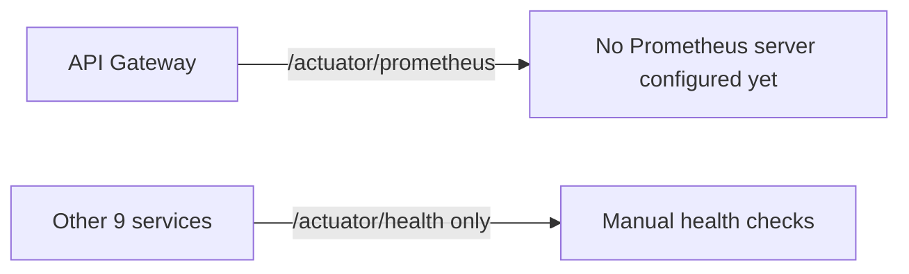
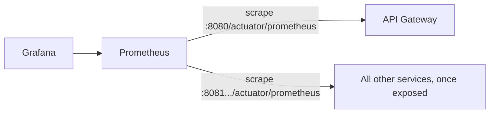

# Section 9: Metrics

## 1. Title
Metrics — Actuator Everywhere, Prometheus on the Gateway Only

## Status: Partial — Actuator health implemented on all services; Prometheus scraping implemented on the gateway only; Grafana dashboards proposed

## 2. Internship module requirement
Demonstrate exposing operational metrics (request counts, latency, JVM/CPU) from services in a way a monitoring system (Prometheus/Grafana) can scrape and visualize.

## 3. What was implemented in this project
- **Every** service module (`user-auth`, `demand`, `candidate`, `application`, `interview`, `offer`, `job`, `workforce`, `audit`, `notification`, gateway) has `spring-boot-starter-actuator` as a dependency, so `/actuator/health` and `/actuator/info` work everywhere.
- **Prometheus scraping** (`micrometer-registry-prometheus`) is a dependency **only in `talentgrid-api-gateway-service`**. Its `application.yml` exposes `management.endpoints.web.exposure.include: health,info,metrics,prometheus`, so `/actuator/prometheus` returns real scrapeable metrics on the gateway.
- Other services' actuator exposure is narrower — e.g. `talentgrid-notification-service` explicitly sets `management.endpoints.web.exposure.include=health,info` only, meaning `/actuator/metrics` and `/actuator/prometheus` are **not** exposed there today, even though the underlying Micrometer core metrics exist in-process.
- No `prometheus.yml` scrape config file or Prometheus Docker service was found anywhere in the repo.
- No Grafana dashboard JSON was found; `observability/grafana/` is an empty placeholder folder (`.gitkeep` only).

## 4. If not implemented — status
`Status: Proposed / Not yet implemented` for: Prometheus server + scrape config, Grafana + dashboards, and exposing `/actuator/prometheus` on the 9 non-gateway services.

## 5. Why this is needed in microservices
Health checks answer "is it up?" — metrics answer "is it healthy under load?" (latency, error rate, JVM memory/GC, thread pool saturation). Prometheus + Grafana is the standard way to scrape and visualize these across many independently deployed services without manually checking each one.

## 6. Architecture explanation — current


## 7. Architecture explanation — proposed


## 8. Dependencies (existing on gateway; proposed for the rest)
```xml
<dependency>
    <groupId>io.micrometer</groupId>
    <artifactId>micrometer-registry-prometheus</artifactId>
</dependency>
```

## 9. Actuator config (existing, gateway)
```yaml
management:
  endpoints:
    web:
      exposure:
        include: health,info,metrics,prometheus
  endpoint:
    health:
      show-details: always
```

## 10. Proposed: expose metrics on remaining services
```properties
management.endpoints.web.exposure.include=health,info,metrics,prometheus
```
(Change from the current `health,info`-only setting in services like `talentgrid-notification-service`.)

## 11. Proposed `prometheus.yml`
```yaml
global:
  scrape_interval: 15s
scrape_configs:
  - job_name: 'talentgrid-gateway'
    metrics_path: '/actuator/prometheus'
    static_configs:
      - targets: ['host.docker.internal:8080']
  - job_name: 'talentgrid-demand-service'
    metrics_path: '/actuator/prometheus'
    static_configs:
      - targets: ['host.docker.internal:8082']
```

## 12. Proposed Docker Compose snippet
```yaml
  prometheus:
    image: prom/prometheus:latest
    container_name: talentgrid-prometheus
    volumes:
      - ./observability/prometheus.yml:/etc/prometheus/prometheus.yml
    ports:
      - "9090:9090"

  grafana:
    image: grafana/grafana:latest
    container_name: talentgrid-grafana
    ports:
      - "3000:3000"
    volumes:
      - ./observability/grafana:/etc/grafana/provisioning
```

## 13. What metrics are already available (in-process, via Micrometer, even without Prometheus scraping)
Request count, response time (HTTP server metrics), JVM memory, JVM GC, CPU usage — all standard Spring Boot Actuator/Micrometer metrics, viewable per-metric via `/actuator/metrics/<name>` on any service today (e.g. `/actuator/metrics/jvm.memory.used`), even where `/actuator/prometheus` isn't exposed.

## 14. curl commands
```bash
curl -s http://localhost:8080/actuator/health
curl -s http://localhost:8080/actuator/prometheus | head -20
curl -s http://localhost:8080/actuator/metrics/http.server.requests
curl -s http://localhost:8083/actuator/metrics/jvm.memory.used
```

## 15. Technologies used
Spring Boot Actuator (all services), Micrometer + Prometheus registry (gateway only). Proposed: Prometheus server, Grafana.

## 16. Files inspected
Every service `pom.xml`, `talentgrid-api-gateway-service/src/main/resources/application.yml`, `talentgrid-notification-service/src/main/resources/application.properties`, `observability/grafana/.gitkeep`, `talentgrid-observability/metrics/.gitkeep`.

## 17. Files changed or to be changed
None changed. If implemented: `management.endpoints.web.exposure.include` in 9 services' config, new `prometheus.yml`, `docker-compose.yml` additions, Grafana dashboard JSON.

## Docker Compose changes
None made — proposed snippet above only.

## Local run commands
```bash
docker compose up -d
cd talentgrid-api-gateway-service && ../mvnw spring-boot:run
```

## Expected output
`/actuator/health` → `{"status":"UP"}`. `/actuator/prometheus` → Prometheus text-format metrics (only on the gateway today).

## Screenshot checklist
- [ ] `/actuator/prometheus` raw output from the gateway
- [ ] (Once implemented) Grafana dashboard showing request latency across services

`Screenshot: <ATTACH_SCREENSHOT_HERE>`

## GitHub/MR link
`GitHub/MR Link: <PASTE_LINK_HERE>`

## Troubleshooting
- `404` on `/actuator/prometheus` for a non-gateway service is expected today — it isn't exposed there yet (see section 3).
- If Prometheus can't scrape a service running outside Docker, use `host.docker.internal` as the target host on macOS/Windows.

## Mentor review checklist
- [ ] Confirms the gateway-only Prometheus exposure is called out honestly (not implied as universal)
- [ ] Confirms proposed scrape targets match this project's real ports
- [ ] Confirms Grafana section is clearly marked proposed, matching the empty `observability/grafana/` folder

---
Back to: [00 Overview](00-module-8-overview.md) · Previous: [08 Logs](08-logs.md) · Next: [10 Traces](10-traces.md)
