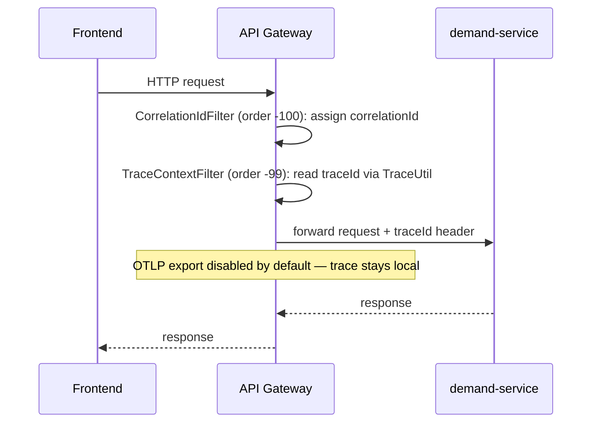
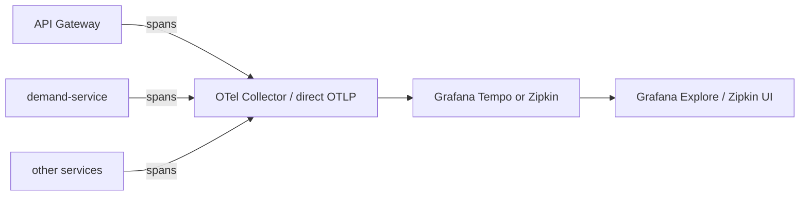

# Section 10: Traces

## 1. Title
Distributed Tracing — Gateway-Level Trace Propagation Implemented; Full Backend + Zipkin/Tempo Wiring Proposed

## Status: Partial — trace ID generation/propagation exists at the gateway; OTLP export is disabled by default; no tracing backend is wired into this repo

## 2. Internship module requirement
Demonstrate understanding of distributed tracing: how a single request's path across multiple services can be reconstructed using trace IDs and span IDs.

## 3. What was implemented in this project
- `talentgrid-api-gateway-service/pom.xml` includes `io.micrometer:micrometer-tracing-bridge-otel` (Micrometer Tracing with an OpenTelemetry/Brave bridge).
- Custom classes exist and are real, working code:
  - `TraceUtil.java` — retrieves the current OpenTelemetry/Micrometer trace ID.
  - `TraceConstants.java` — centralizes the trace header name and MDC key.
  - `TraceContextFilter.java` — a `GlobalFilter` (order `-99`, runs right after `CorrelationIdFilter`) that puts the current trace ID into MDC and forwards it as a header to downstream services.
  - `CorrelationIdFilter.java` — generates/forwards a request correlation ID (separate concept from the OTel trace ID; see `08-logs.md`).
- `application.yml` configures:
  ```yaml
  management:
    otlp:
      tracing:
        endpoint: ${OTEL_EXPORTER_OTLP_ENDPOINT:http://localhost:4318/v1/traces}
        export:
          enabled: ${OTEL_TRACING_EXPORT_ENABLED:false}
    tracing:
      sampling:
        probability: ${OTEL_TRACING_SAMPLING_PROBABILITY:1.0}
  ```
  **`export.enabled` defaults to `false`** — so today, trace IDs are generated and propagated in-process/via headers, but they are **not shipped to any tracing backend** unless `OTEL_TRACING_EXPORT_ENABLED=true` is explicitly set and an OTLP collector is actually listening on port 4318.
- No `micrometer-tracing-bridge-otel` (or Brave/Zipkin) dependency was found in any of the 9 downstream domain services — trace propagation exists only at the gateway boundary today.
- A Zipkin container (`talentgrid-t4-zipkin`, port 9411) was observed running on the local machine during inspection, but **it is not defined in this repository's `docker-compose.yml`** and no code in this repo references Zipkin at all. It appears to belong to a separate stack (likely the external Team 4 AI service) and should not be assumed to be this project's tracing backend.

## 4. If not implemented — status
`Status: Proposed / Not yet implemented` for: OTLP export actually enabled, a tracing backend (Zipkin or Grafana Tempo) defined in this repo's `docker-compose.yml`, and tracing bridges added to the 9 downstream services so a trace can be reconstructed end-to-end. `observability/tempo/` exists only as an empty placeholder folder (`.gitkeep`).

## 5. Why traces are needed in microservices
A single user action (e.g. "submit a demand") can touch the gateway, `demand-service`, a Kafka event, and `notification-service`. Logs with a shared correlation ID help, but a proper trace (with parent/child spans) shows exact timing — which hop was slow — something plain correlated logs can't show as clearly.

## 6. Gateway-to-service request flow (current, trace ID generated but not exported)


## 7. Proposed: end-to-end tracing with a backend


## 8. Trace ID and span ID
Trace ID: identifies the whole request journey across all services. Span ID: identifies one hop/operation within that journey (e.g. "gateway → demand-service call"). Micrometer Tracing (OTel bridge) generates both automatically once instrumentation is present on a service; this project currently only has that instrumentation at the gateway.

## 9. Docker Compose Zipkin snippet (proposed)
```yaml
  zipkin:
    image: openzipkin/zipkin:latest
    container_name: talentgrid-zipkin
    ports:
      - "9411:9411"
    networks:
      - talentgrid-network
```
(Or, to align with the already-scaffolded `observability/tempo/` folder, Grafana Tempo instead of Zipkin — either is a valid OTLP-compatible backend.)

## 10. Dependencies (proposed, per downstream service)
```xml
<dependency>
    <groupId>io.micrometer</groupId>
    <artifactId>micrometer-tracing-bridge-otel</artifactId>
</dependency>
<dependency>
    <groupId>io.opentelemetry</groupId>
    <artifactId>opentelemetry-exporter-zipkin</artifactId>
</dependency>
```

## 11. Application config (proposed, to actually enable export)
```properties
OTEL_TRACING_EXPORT_ENABLED=true
OTEL_EXPORTER_OTLP_ENDPOINT=http://localhost:4318/v1/traces
management.tracing.sampling.probability=1.0
```

## 12. Example request flow through the gateway (verification, once a backend is wired)
```bash
curl -i http://localhost:8080/api/v1/demands \
  -H "Authorization: Bearer <ACCESS_TOKEN>"
```
Then search the tracing UI for the trace ID returned in the response header (`TraceConstants.TRACE_ID_HEADER`).

## 13. Zipkin URL (once wired into this repo's compose)
`http://localhost:9411`

## 14. Technologies used
Existing: Micrometer Tracing with OTel bridge (gateway only), custom `TraceUtil`/`TraceContextFilter`. Proposed: OTLP export enabled, Zipkin or Grafana Tempo backend, tracing bridge added to all 9 domain services.

## 15. Files inspected
`talentgrid-api-gateway-service/pom.xml`, `src/main/resources/application.yml`, `src/main/java/.../util/TraceUtil.java`, `constants/TraceConstants.java`, `filter/TraceContextFilter.java`, `filter/CorrelationIdFilter.java`, `observability/tempo/.gitkeep`, `talentgrid-observability/tracing/.gitkeep`.

## 16. Files changed or to be changed
None changed. If implemented: `docker-compose.yml` (Zipkin/Tempo service), each of the 9 domain services' `pom.xml` + config, `.env` (`OTEL_TRACING_EXPORT_ENABLED=true`).

## Docker Compose changes
None made — proposed snippet above only. Note: the Zipkin container currently visible via `docker ps` on this machine (`talentgrid-t4-zipkin`, port 9411) is **not** part of this repository's `docker-compose.yml` and should not be cited as evidence of tracing being wired into this codebase.

## Local run commands
```bash
cd talentgrid-api-gateway-service && ../mvnw spring-boot:run
```

## Verification steps
```bash
curl -i http://localhost:8080/actuator/health
# then check the response header defined by TraceConstants.TRACE_ID_HEADER
```

## Screenshot checklist
- [ ] A response showing the trace ID header returned by the gateway
- [ ] (Once implemented) Zipkin/Tempo UI showing a full trace spanning gateway + downstream service

`Screenshot: <ATTACH_SCREENSHOT_HERE>`

## GitHub/MR link
`GitHub/MR Link: <PASTE_LINK_HERE>`

## Troubleshooting
- No spans appearing in Zipkin/Tempo: confirm `OTEL_TRACING_EXPORT_ENABLED=true` and that the collector is actually reachable at the configured OTLP endpoint — by default this is disabled specifically to avoid error-log spam in local dev (see comment in `application.yml`).
- Downstream services show no trace context: expected today, since only the gateway has the tracing bridge dependency.

## Mentor review checklist
- [ ] Confirms OTLP export defaulting to `false` is called out (not glossed over)
- [ ] Confirms the unrelated host Zipkin container is correctly described as external, not part of this repo
- [ ] Confirms tracing is honestly scoped as gateway-only today

---
Back to: [00 Overview](00-module-8-overview.md) · Previous: [09 Metrics](09-metrics.md) · Next: [11 Final Checklist](11-final-checklist.md)
