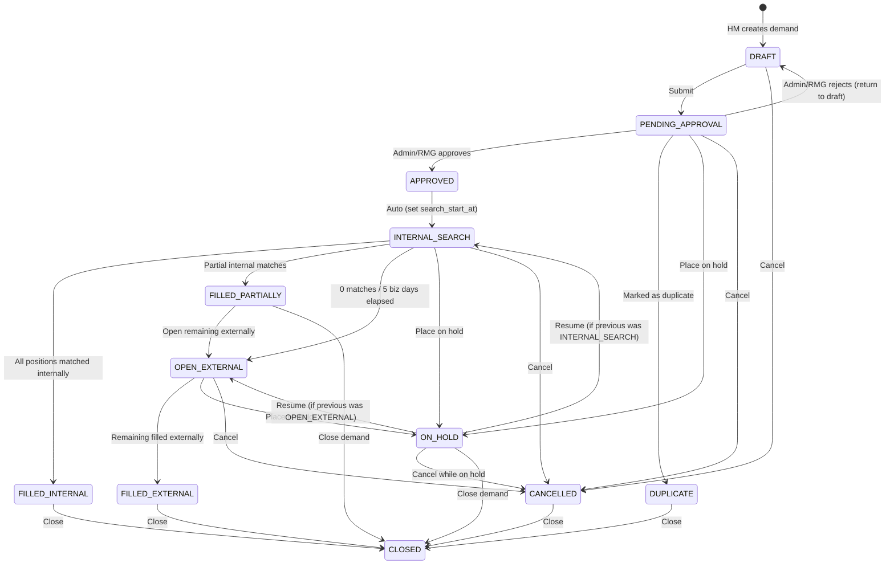

# TalentGrid Demand Service

The **Demand Service** is a core microservice in the TalentGrid ecosystem responsible for the complete lifecycle management of workforce demands. It handles everything from initial demand creation (Draft) to final fulfillment, tracking internal bench assignments and external recruitment metrics.

This service is built with Spring Boot, utilizes PostgreSQL for robust relational data persistence, and integrates with Apache Kafka for asynchronous event broadcasting across the enterprise ecosystem.

---

## 🏗️ Architecture & Stack

- **Framework**: Spring Boot 3.5.x / Java 17
- **Database**: PostgreSQL (JPA / Hibernate)
- **Messaging**: Apache Kafka (Event-driven architecture)
- **Security**: Stateless JWT Authentication with `@PreAuthorize` role enforcement
- **Inter-service Communication**: OpenFeign (`user-auth-service`, `notification-client`, `audit-client`)

---

## 🚀 Getting Started

### Prerequisites
- **Java 17**
- **Apache Maven** (or use the provided `mvnw` wrapper)
- **PostgreSQL** running locally on port `5432`
- **Apache Kafka & Zookeeper** running locally on port `9092`

### Running the Application Locally

1. **Start Infrastructure (Docker)**:
   Ensure your PostgreSQL and Kafka containers are running via the root `docker-compose.yml`.

   *Note: Ensure your `application.yml` database credentials are set to match these values.*

2. **Build and Run the Service**:
   Navigate to the `demand-service` directory and execute:
   ```bash
   mvn clean spring-boot:run
   ```
   Or if memory constrained:
   ```bash
   export MAVEN_OPTS="-Xmx512m" && mvn clean spring-boot:run
   ```

The service will start on `http://localhost:8081`.

---

## 🔄 Demand Lifecycle State Machine

The Demand Service employs a strict state machine to govern the progression of a workforce demand.



### Complete Transition Matrix

| Current State | Allowed Target States |
|:---|:---|
| `DRAFT` | `PENDING_APPROVAL`, `CANCELLED` |
| `PENDING_APPROVAL` | `APPROVED`, `DRAFT` (reject), `DUPLICATE`, `ON_HOLD`, `CANCELLED` |
| `APPROVED` | `INTERNAL_SEARCH` (auto) |
| `INTERNAL_SEARCH` | `FILLED_INTERNAL`, `FILLED_PARTIALLY`, `OPEN_EXTERNAL`, `ON_HOLD`, `CANCELLED` |
| `FILLED_PARTIALLY` | `OPEN_EXTERNAL`, `CLOSED` |
| `OPEN_EXTERNAL` | `FILLED_EXTERNAL`, `ON_HOLD`, `CANCELLED` |
| `ON_HOLD` | `INTERNAL_SEARCH` (resume), `OPEN_EXTERNAL` (resume), `CANCELLED`, `CLOSED` |
| `FILLED_INTERNAL` | `CLOSED` |
| `FILLED_EXTERNAL` | `CLOSED` |
| `CANCELLED` | `CLOSED` |
| `DUPLICATE` | `CLOSED` |
| `CLOSED` | *(terminal — no further transitions)* |

> **Note:** Any transition not explicitly listed above will return an **HTTP 409/400** with an `IllegalDemandTransitionException`.

---

## ⚖️ Core Business Rules

1. **RMG 5-Business-Day Gate**:
   Transitions from `INTERNAL_SEARCH` to `OPEN_EXTERNAL` are **blocked** unless at least 5 business days have passed since `search_start_at`.
   *(Exception: If partial fulfillment happens within the 5 days, the gate is bypassed.)*

2. **ON_HOLD Resume Logic**:
   When a demand enters `ON_HOLD`, its previous state is cached (`previousStatus`). Upon resuming, the transition engine strictly validates that the demand returns **only** to its previous state (e.g., you cannot hold an `INTERNAL_SEARCH` and magically resume directly into `OPEN_EXTERNAL`).

3. **Closure Reason Validation**:
   Terminal transitions require a `closureReason`. The engine enforces that the supplied reason mathematically aligns with the target state (e.g., trying to set target `FILLED_INTERNAL` but supplying `CANCELLED` as a reason will throw an error).

4. **Split Tracking**:
   The entity carefully tracks `requiredCount`, `internalFilledCount`, and `externalFilledCount`. 
   `recruitedCount` is computed automatically.

---

## 🌐 REST API Endpoints

### Demand CRUD

| Method | Endpoint | Description |
|:---|:---|:---|
| `GET` | `/api/demands` | Enterprise demand search (Filters: status, priority, business unit, etc.) |
| `POST` | `/api/demands` | Create a new workforce demand. Status initializes as `DRAFT`. |
| `GET` | `/api/demands/{id}` | Fetch granular details for a specific demand. |
| `PATCH`| `/api/demands/{id}` | Update editable fields. **Restricted to DRAFT state only.** |
| `DELETE`| `/api/demands/{id}`| Soft delete (`is_deleted = true`). **Restricted to DRAFT state only.** |

### Demand Workflow & Lifecycle

| Method | Endpoint | Description |
|:---|:---|:---|
| `POST` | `/api/demands/{id}/approve` | Review an incoming demand. (`APPROVED` cascades instantly to `INTERNAL_SEARCH`) |
| `PATCH` | `/api/demands/{id}/status` | Trigger a state transition. Expects `targetStatus` and optional `comments`/`closureReason`. |
| `GET` | `/api/demands/{id}/pipeline` | Retrieves the real-time split of internal/external recruiting counts and status audit trails. |
| `GET` | `/api/demands/{id}/history` | Retrieves the chronological timeline (audit trail) of status modifications. |

### Analytics

| Method | Endpoint | Description |
|:---|:---|:---|
| `GET` | `/api/analytics/demands` | Comprehensive analytics: total demands, active searches, fill rates, avg time-to-fill, and internal vs. external ratios. |

---

## 📡 Kafka Events

The service acts as a producer, broadcasting real-time asynchronous events upon key lifecycle milestones. All events are published to the unified `demand-events` Kafka topic with the demand ID as the routing key, ensuring strict partition affinity and chronological ordering.

| Event Type | Trigger Condition |
|:---|:---|
| `DEMAND_CREATED` | A new demand is initially created in `DRAFT` status. |
| `DEMAND_SUBMITTED` | `DRAFT` → `PENDING_APPROVAL` (Submitted for RMG/Admin review). |
| `DEMAND_APPROVED` | `PENDING_APPROVAL` → `APPROVED` (Auto-cascades to `INTERNAL_SEARCH`). |
| `DEMAND_EXTERNAL_OPENED` | `INTERNAL_SEARCH` or `FILLED_PARTIALLY` → `OPEN_EXTERNAL`. |
| `DEMAND_FILLED_INTERNALLY` | `INTERNAL_SEARCH` → `FILLED_INTERNAL` (All positions matched internally). |
| `DEMAND_FILLED_PARTIALLY` | `INTERNAL_SEARCH` → `FILLED_PARTIALLY` (Some internal matches found). |
| `DEMAND_FILLED_EXTERNALLY` | `OPEN_EXTERNAL` → `FILLED_EXTERNAL` (Remaining positions filled). |
| `DEMAND_ON_HOLD` | Demand is placed `ON_HOLD`. |
| `DEMAND_RESUMED` | Demand is resumed from `ON_HOLD` to its previous active state. |
| `DEMAND_CANCELLED` | Demand is transitioned to `CANCELLED`. |
| `DEMAND_DUPLICATE` | Demand is transitioned to `DUPLICATE`. |
| `DEMAND_CLOSED` | Terminal state reached (`CLOSED`). |
