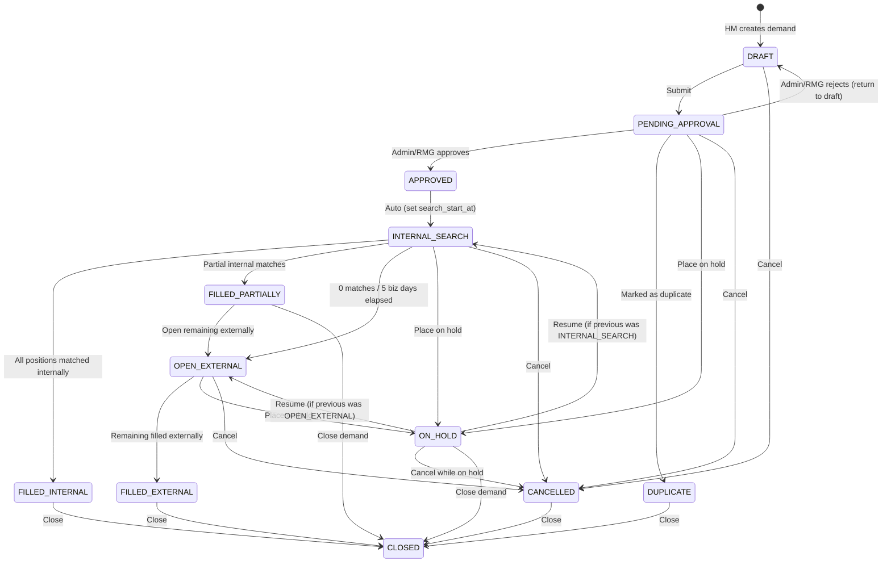

# TalentGrid Demand Service

The **Demand Service** is a core microservice in the TalentGrid ecosystem responsible for the complete lifecycle management of workforce demands. It handles everything from initial demand creation (Draft) to final fulfillment, tracking internal bench assignments and external recruitment metrics.

This service is built with Spring Boot, utilizes PostgreSQL for robust relational data persistence, and integrates with Apache Kafka for asynchronous event broadcasting across the enterprise ecosystem.

---

## 🏗️ Architecture & Stack

- **Framework**: Spring Boot 3.5.x / Java 17
- **Database**: PostgreSQL (JPA / Hibernate)
- **Messaging**: Apache Kafka (Event-driven architecture)
- **Security**: Stateless JWT Authentication with `@PreAuthorize` role enforcement
- **Inter-service Communication**: OpenFeign (`user-auth-service`, `notification-client`, `audit-client`)

---

## 🚀 Getting Started

### Prerequisites
- **Java 17**
- **Apache Maven** (or use the provided `mvnw` wrapper)
- **PostgreSQL** running locally on port `5432`
- **Apache Kafka & Zookeeper** running locally on port `9092`

### Running the Application Locally

1. **Start Infrastructure (Docker)**:
   Ensure your PostgreSQL and Kafka containers are running via the root `docker-compose.yml`.

   *Note: Ensure your `application.yml` database credentials are set to match these values.*

2. **Build and Run the Service**:
   Navigate to the `demand-service` directory and execute:
   ```bash
   mvn clean spring-boot:run
   ```
   Or if memory constrained:
   ```bash
   export MAVEN_OPTS="-Xmx512m" && mvn clean spring-boot:run
   ```

The service will start on `http://localhost:8081`.

---

## 🔄 Demand Lifecycle State Machine

The Demand Service employs a strict state machine to govern the progression of a workforce demand.



### Complete Transition Matrix

| Current State | Allowed Target States |
|:---|:---|
| `DRAFT` | `PENDING_APPROVAL`, `CANCELLED` |
| `PENDING_APPROVAL` | `APPROVED`, `DRAFT` (reject), `DUPLICATE`, `ON_HOLD`, `CANCELLED` |
| `APPROVED` | `INTERNAL_SEARCH` (auto) |
| `INTERNAL_SEARCH` | `FILLED_INTERNAL`, `FILLED_PARTIALLY`, `OPEN_EXTERNAL`, `ON_HOLD`, `CANCELLED` |
| `FILLED_PARTIALLY` | `OPEN_EXTERNAL`, `CLOSED` |
| `OPEN_EXTERNAL` | `FILLED_EXTERNAL`, `ON_HOLD`, `CANCELLED` |
| `ON_HOLD` | `INTERNAL_SEARCH` (resume), `OPEN_EXTERNAL` (resume), `CANCELLED`, `CLOSED` |
| `FILLED_INTERNAL` | `CLOSED` |
| `FILLED_EXTERNAL` | `CLOSED` |
| `CANCELLED` | `CLOSED` |
| `DUPLICATE` | `CLOSED` |
| `CLOSED` | *(terminal — no further transitions)* |

> **Note:** Any transition not explicitly listed above will return an **HTTP 409/400** with an `IllegalDemandTransitionException`.

---

## ⚖️ Core Business Rules

1. **RMG 5-Business-Day Gate**:
   Transitions from `INTERNAL_SEARCH` to `OPEN_EXTERNAL` are **blocked** unless at least 5 business days have passed since `search_start_at`.
   *(Exception: If partial fulfillment happens within the 5 days, the gate is bypassed.)*

2. **ON_HOLD Resume Logic**:
   When a demand enters `ON_HOLD`, its previous state is cached (`previousStatus`). Upon resuming, the transition engine strictly validates that the demand returns **only** to its previous state (e.g., you cannot hold an `INTERNAL_SEARCH` and magically resume directly into `OPEN_EXTERNAL`).

3. **Closure Reason Validation**:
   Terminal transitions require a `closureReason`. The engine enforces that the supplied reason mathematically aligns with the target state (e.g., trying to set target `FILLED_INTERNAL` but supplying `CANCELLED` as a reason will throw an error).

4. **Split Tracking**:
   The entity carefully tracks `requiredCount`, `internalFilledCount`, and `externalFilledCount`. 
   `recruitedCount` is computed automatically.

---

## 🌐 REST API Endpoints

### Demand CRUD

| Method | Endpoint | Description |
|:---|:---|:---|
| `GET` | `/api/demands` | Enterprise demand search (Filters: status, priority, business unit, etc.) |
| `POST` | `/api/demands` | Create a new workforce demand. Status initializes as `DRAFT`. |
| `GET` | `/api/demands/{id}` | Fetch granular details for a specific demand. |
| `PATCH`| `/api/demands/{id}` | Update editable fields. **Restricted to DRAFT state only.** |
| `DELETE`| `/api/demands/{id}`| Soft delete (`is_deleted = true`). **Restricted to DRAFT state only.** |

### Demand Workflow & Lifecycle

| Method | Endpoint | Description |
|:---|:---|:---|
| `POST` | `/api/demands/{id}/approve` | Review an incoming demand. (`APPROVED` cascades instantly to `INTERNAL_SEARCH`) |
| `PATCH` | `/api/demands/{id}/status` | Trigger a state transition. Expects `targetStatus` and optional `comments`/`closureReason`. |
| `GET` | `/api/demands/{id}/pipeline` | Retrieves the real-time split of internal/external recruiting counts and status audit trails. |
| `GET` | `/api/demands/{id}/history` | Retrieves the chronological timeline (audit trail) of status modifications. |

### Analytics

| Method | Endpoint | Description |
|:---|:---|:---|
| `GET` | `/api/analytics/demands` | Comprehensive analytics: total demands, active searches, fill rates, avg time-to-fill, and internal vs. external ratios. |

---

## 📡 Kafka Events

The service acts as a producer, broadcasting real-time asynchronous events upon key lifecycle milestones. All events are published to the unified `demand-events` Kafka topic with the demand ID as the routing key, ensuring strict partition affinity and chronological ordering.

| Event Type | Trigger Condition |
|:---|:---|
| `DEMAND_CREATED` | A new demand is initially created in `DRAFT` status. |
| `DEMAND_SUBMITTED` | `DRAFT` → `PENDING_APPROVAL` (Submitted for RMG/Admin review). |
| `DEMAND_APPROVED` | `PENDING_APPROVAL` → `APPROVED` (Auto-cascades to `INTERNAL_SEARCH`). |
| `DEMAND_EXTERNAL_OPENED` | `INTERNAL_SEARCH` or `FILLED_PARTIALLY` → `OPEN_EXTERNAL`. |
| `DEMAND_FILLED_INTERNALLY` | `INTERNAL_SEARCH` → `FILLED_INTERNAL` (All positions matched internally). |
| `DEMAND_FILLED_PARTIALLY` | `INTERNAL_SEARCH` → `FILLED_PARTIALLY` (Some internal matches found). |
| `DEMAND_FILLED_EXTERNALLY` | `OPEN_EXTERNAL` → `FILLED_EXTERNAL` (Remaining positions filled). |
| `DEMAND_ON_HOLD` | Demand is placed `ON_HOLD`. |
| `DEMAND_RESUMED` | Demand is resumed from `ON_HOLD` to its previous active state. |
| `DEMAND_CANCELLED` | Demand is transitioned to `CANCELLED`. |
| `DEMAND_DUPLICATE` | Demand is transitioned to `DUPLICATE`. |
| `DEMAND_CLOSED` | Terminal state reached (`CLOSED`). |


# TalentGrid Demand & Notification Lifecycle Verification Guide

---

## 📌 Project Overview

This platform orchestrates enterprise workforce hiring requests (**Demands**) across a decoupled microservices architecture. It utilizes **Apache Kafka** as an asynchronous event-driven backbone to safely broadcast state machine transitions between core services.

```
[Client / Curl] 
       │
       ▼
[demand-service] ──(Kafka: demand-events Topic)──► [DemandEventTranslator]
                                                          │
                                                (Kafka: notification.send)
                                                          │
                                                          ▼
[Real Inbox / Email] ◄────────────────────────── [notification-service]

```

When an event occurs (such as submitting or approving a demand), **`demand-service`** broadcasts an immutable lifecycle token over Kafka. An internal listener catches the message, processes business mapping rules, and commands the **`notification-service`** to dynamically render rich HTML email templates and route them to real inboxes.

---

## 🛠️ Prerequisites

* **Java:** Version 21 or 25


* **Local Database:** PostgreSQL initialized and running locally on port `5432`

* **Kafka Broker:** Apache Kafka cluster running on port `9092`


---

## 🚀 Running the Applications

### 1. Build the Project Ecosystem

From the root project directory, compile and package all modules and shared libraries:

```bash
mvn clean install -DskipTests

```

### 2. Configure Mailroom Properties (Crucial for Real Email Delivery)

Before launching the services, you must equip the notification daemon with mail server credentials. Open the properties file located at `talentgrid-notification-service/src/main/resources/application.properties` and add your account details:

```properties
spring.mail.username=your-gmail@gmail.com
spring.mail.password=xxxx-xxxx-xxxx-xxxx   # Your 16-character Google App Password (NOT your login password)
notification.email.from=your-gmail@gmail.com

```

> **💡 Generation Tip:** You can quickly generate a secure 16-character App Password by visiting your account security dashboard at [https://myaccount.google.com/apppasswords](https://myaccount.google.com/apppasswords).
>
>
> If you ever need to temporarily mute email routing during offline runs, set `notification.email.enabled=false`.
>
>

### 3. Start the Notification Service

Navigate to the notification module directory and run it:

```bash
cd talentgrid-notification-service
mvn spring-boot:run

```

> **Expected Status:** Confirm console outputs `Started NotificationServiceApplication on port 8085` and is listening to group `notification-service-group`.
>
>

### 4. Start the Demand Service

Open a fresh terminal window, navigate to the demand service module directory, and run it:

```bash
cd services/demand-service
mvn spring-boot:run

```

> **Expected Status:** Confirm console outputs `Started DemandServiceApplication on port 8081` and logs `Subscribed to topic(s): demand-events`.
>
>

---

## 🧪 End-to-End Foolproof Verification Sequence

These single-line terminal commands ensure your shell parses the JSON string seamlessly without whitespace or newline failures.

### Step 1: Create a Fresh Draft Demand

This maps strictly to your service's data contract constraints (`clientInterview`, `businessUnit`, `budget`, `targetDate`) and specific granular enterprise grade enum definitions (`T3_SENIOR`, `FULL_TIME`).

```bash
curl -X POST http://localhost:8081/api/demands -H "Content-Type: application/json" -d '{"title": "Senior Java Developer", "description": "Experienced Java/Spring Boot developer needed for TalentGrid platform", "level": "T3_SENIOR", "skills": ["Java", "Spring Boot", "Kafka", "PostgreSQL"], "location": "Chennai", "workMode": "HYBRID", "experience": 5, "department": "Engineering", "employmentType": "FULL_TIME", "requiredCount": 2, "priority": "HIGH", "accountId": 1, "projectId": 1, "businessUnit": "Enterprise Applications", "budget": 150000.00, "targetDate": "2026-08-31", "clientInterview": true}'

```

* **Expected Output:** Returns a `201 Created` payload with `"status":"DRAFT"`.


* **Action Item:** Identify and look at the value assigned to **`"demandId"`** in the JSON output block (Assume it is **`3`** for the steps below).

---

### Step 2: Route local event alerts to your corporate email

Because local test profiles secure authentication via a default mock session (`creator@griddynamics.com`), you must execute a brief database routing override so the Kafka workers find your actual mailbox.

Log into your local PostgreSQL database client tool or native terminal container and run:

```sql
UPDATE demands SET creator_email = 'your-email@griddynamics.com' WHERE demand_id = 3;

```

*(Swap `your-email@griddynamics.com` with your actual corporate email address, and verify `demand_id` matches your step 1 response output.)*

---

### Step 3: Submit the Demand for Management Approval

Transition the demand out of a draft status using a `PATCH` payload:

```bash
curl -i -X PATCH http://localhost:8081/api/demands/3/status -H "Content-Type: application/json" -d '{"targetStatus": "PENDING_APPROVAL", "comments": "Submitting verification run"}'

```

* **Expected Output:** `200 OK`.


* **📧 Verification:** Check your mailbox. You will receive an automated **Demand Submitted for Approval** layout.


---

### Step 4: Approve the Request

Enforce managerial signature clearing to release the demand to sourcing teams via a `POST` mapping:

```bash
curl -i -X POST http://localhost:8081/api/demands/3/approve -H "Content-Type: application/json" -d '{"decision": "APPROVED", "comments": "Approved", "assignedRm": 101, "assignedRmName": "Rahul Mehta"}'

```

* **Expected Output:** `200 OK`. The status shifts securely to `"INTERNAL_SEARCH"`.
* **📧 Verification:** Check your mailbox. You will receive a **Demand Approved** layout stating "Approved By: Admin User".


---

### Step 5: Fast-Forward the RMG Time Gate

Your core state engine prevents exposing demands to outside staffing agencies (`OPEN_EXTERNAL`) unless the local internal workbench team has exhausted search efforts for 5 business days.

To fast-forward this restriction for your testing, run this time-travel script in your PostgreSQL instance:

```sql
UPDATE demands SET search_start_at = NOW() - INTERVAL '6 days' WHERE demand_id = 3;

```

---

### Step 6: Open the Demand to External Vendors

With the 5-day security check cleared, release the specification externally using a `PATCH` payload:

```bash
curl -i -X PATCH http://localhost:8081/api/demands/3/status -H "Content-Type: application/json" -d '{"targetStatus": "OPEN_EXTERNAL", "comments": "Opening up to external agencies"}'

```

* **Expected Output:** `200 OK`.
* **📧 Verification:** Check your mailbox. You will receive an **External Hiring Opened** notification layout.


---

### Step 7: Log External Fulfillment Milestone

The state machine strictly bars moving directly from searching to archiving without intermediate fulfillment logging. Transition to the completed milestone flag first:

```bash
curl -i -X PATCH http://localhost:8081/api/demands/3/status -H "Content-Type: application/json" -d '{"targetStatus": "FILLED_EXTERNAL", "closureReason": "FILLED_EXTERNAL", "comments": "All positions filled successfully via external tracking."}'

```

* **Expected Output:** `200 OK`.

---

### Step 8: Terminal Lifecycle Closure

Now that the positions have been marked as fulfilled, permanently lock and complete the lifecycle file record:

```bash
curl -i -X PATCH http://localhost:8081/api/demands/3/status -H "Content-Type: application/json" -d '{"targetStatus": "CLOSED", "closureReason": "FILLED_EXTERNAL", "comments": "Closing out the demand record permanently."}'

```

* **Expected Output:** `200 OK` status showing terminal state `"status":"CLOSED"`.
* **📧 Verification:** Check your mailbox. You will receive a final **Demand Closed** data breakdown message summarizing headcount completion matrices!


**Note:**
```markdown
## 🛰️ Consuming Demand Events

Other microservices can subscribe to demand lifecycle updates by listening to the `demand-events` Kafka topic.

### 1. Add Dependency
Include the shared Kafka library module in your service's `pom.xml` file:

```xml
<dependency>
    <groupId>com.talentgrid</groupId>
    <artifactId>talentgrid-kafka</artifactId>
    <version>${project.version}</version>
</dependency>

```

### 2. Configure Properties

Add these configuration settings to your `application.properties` file. Because `add.type.headers=false` is enforced across the platform, you must explicitly declare the target deserialization wrapper class type:

```properties
spring.kafka.consumer.group-id=your-service-group
spring.json.value.default.type=com.talentgrid.kafka.events.BaseEvent

```

### 3. Implement Kafka Listener

Create a listener component to extract and handle incoming payload event packets:

```java
package com.talentgrid.yourservice.kafka;

import com.talentgrid.kafka.events.BaseEvent;
import com.talentgrid.kafka.events.demand.DemandPayload;
import org.springframework.kafka.annotation.KafkaListener;
import org.springframework.stereotype.Component;

@Component
public class DemandEventSubscriber {

    @KafkaListener(topics = "demand-events", groupId = "your-service-group")
    public void onEvent(BaseEvent<DemandPayload> event) {
        String eventType = event.getEventType(); // Can be DEMAND_SUBMITTED, DEMAND_APPROVED, DEMAND_EXTERNAL_OPENED, DEMAND_CLOSED
        DemandPayload payload = event.getPayload();
        
        System.out.printf("Processed lifecycle event [%s] for Demand ID: %d%n", eventType, payload.getDemandId());
    }
}

```

```

```