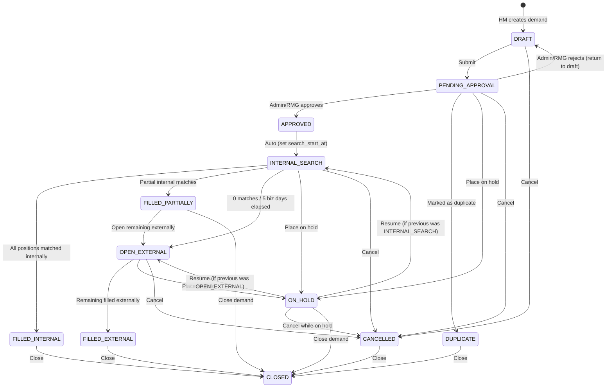

# Implementation Plan — Demand Domain Model, CRUD & State Machine

## State Machine



### Complete Transition Matrix

| Current State | Allowed Target States |
|:---|:---|
| `DRAFT` | `PENDING_APPROVAL`, `CANCELLED` |
| `PENDING_APPROVAL` | `APPROVED`, `DRAFT` (reject), `DUPLICATE`, `ON_HOLD`, `CANCELLED` |
| `APPROVED` | `INTERNAL_SEARCH` (auto) |
| `INTERNAL_SEARCH` | `FILLED_INTERNAL`, `FILLED_PARTIALLY`, `OPEN_EXTERNAL`, `ON_HOLD`, `CANCELLED` |
| `FILLED_PARTIALLY` | `OPEN_EXTERNAL`, `CLOSED` |
| `OPEN_EXTERNAL` | `FILLED_EXTERNAL`, `ON_HOLD`, `CANCELLED` |
| `ON_HOLD` | `INTERNAL_SEARCH` (resume), `OPEN_EXTERNAL` (resume), `CANCELLED`, `CLOSED` |
| `FILLED_INTERNAL` | `CLOSED` |
| `FILLED_EXTERNAL` | `CLOSED` |
| `CANCELLED` | `CLOSED` |
| `DUPLICATE` | `CLOSED` |
| `CLOSED` | *(terminal — no further transitions)* |

> [!IMPORTANT]
> Any transition not listed above returns **HTTP 400** with an `IllegalDemandTransitionException`.

### ON_HOLD Resume Logic

When a demand is placed `ON_HOLD`, the current status is saved to `previous_status`. When resuming:
- The system validates that the requested resume target matches `previous_status`.
- Example: If a demand was in `INTERNAL_SEARCH` before being held, it can only resume to `INTERNAL_SEARCH`, not `OPEN_EXTERNAL`.
- This prevents illegal state jumps via the hold mechanism.

### DemandStatus Enum (12 states)

```
DRAFT, PENDING_APPROVAL, APPROVED, INTERNAL_SEARCH, OPEN_EXTERNAL,
FILLED_PARTIALLY, FILLED_INTERNAL, FILLED_EXTERNAL,
ON_HOLD, CANCELLED, DUPLICATE, CLOSED
```

### Closure Reason Codes & Validation

| Reason Code | Valid for Target State |
|:---|:---|
| `FILLED_INTERNAL` | `FILLED_INTERNAL`, `CLOSED` (from `FILLED_PARTIALLY`) |
| `FILLED_EXTERNAL` | `FILLED_EXTERNAL`, `CLOSED` (from `FILLED_PARTIALLY`) |
| `CANCELLED` | `CANCELLED` |
| `ON_HOLD` | `ON_HOLD` |
| `DUPLICATE` | `DUPLICATE` |

> [!WARNING]
> `TransitionValidator` must enforce that the provided `closure_reason` matches the target state. Mismatched reasons (e.g., reason=`DUPLICATE` with target=`CANCELLED`) return HTTP 400.

### 5-Business-Day RMG Internal-First Gate

- **Gate field**: `search_start_at` (set when demand enters `INTERNAL_SEARCH`)
- **Rule**: Transition from `INTERNAL_SEARCH → OPEN_EXTERNAL` is **blocked** if fewer than 5 business days (excluding weekends) have elapsed since `search_start_at`.
- **Exception**: If `FILLED_INTERNAL` or `FILLED_PARTIALLY` is reached before 5 days, the gate does not apply.

### Kafka Events on Key Transitions

| Transition | Kafka Topic | Payload |
|:---|:---|:---|
| → `PENDING_APPROVAL` | `demand.submitted` | demandId, title, createdBy |
| → `INTERNAL_SEARCH` | `demand.approved` | demandId, approvedBy, searchStartAt |
| → `OPEN_EXTERNAL` | `demand.external.opened` | demandId, requiredCount, internalFilledCount |
| → `FILLED_INTERNAL` | `demand.filled` | demandId, closureReason, internalFilledCount |
| → `FILLED_EXTERNAL` | `demand.filled` | demandId, closureReason, externalFilledCount |
| → `CANCELLED` | `demand.cancelled` | demandId, closureReason, cancelledBy |
| → `CLOSED` | `demand.closed` | demandId, closureReason, recruitedCount |

---

## Demand Table — Full Schema Mapping (27 columns)

| DB Column | JPA Field | Java Type | Constraints / Mapping |
|:---|:---|:---|:---|
| `demand_id` | `demandId` | `Long` | PK, `@Id @GeneratedValue(IDENTITY)` |
| `title` | `title` | `String` | `@Column(nullable=false, length=255)` |
| `description` | `description` | `String` | `@Column(columnDefinition="TEXT")` |
| `level` | `level` | `SeniorityLevel` | `@Enumerated(STRING)` |
| `location` | `location` | `String` | `@Column(length=150)` |
| `project_id` | `projectId` | `Long` | FK → Projects.id |
| `business_unit` | `businessUnit` | `String` | `@Column(length=150)` |
| `skills` | `skills` | `List<String>` | `@JdbcTypeCode(SqlTypes.ARRAY)`, `columnDefinition="text[]"` |
| `budget` | `budget` | `BigDecimal` | `@Column(precision=15, scale=2)` |
| `required_count` | `requiredCount` | `Integer` | Total headcount needed |
| `recruited_count` | `recruitedCount` | `Integer` | = `internalFilledCount + externalFilledCount` |
| `internal_filled_count` | `internalFilledCount` | `Integer` | Filled from internal bench |
| `external_filled_count` | `externalFilledCount` | `Integer` | Filled from external candidates |
| `status` | `status` | `DemandStatus` | `@Enumerated(STRING)` |
| `priority` | `priority` | `DemandPriority` | `@Enumerated(STRING)` |
| `target_date` | `targetDate` | `LocalDate` | Expected fulfillment date |
| `search_start_at` | `searchStartAt` | `OffsetDateTime` | Set on entering `INTERNAL_SEARCH` |
| `closure_reason` | `closureReason` | `String` | `@Column(length=255)` |
| `created_by` | `createdBy` | `Long` | FK → Users.employee_id |
| `assigned_recruiter` | `assignedRecruiter` | `Long` | FK → Users.employee_id |
| `assigned_rm` | `assignedRm` | `Long` | FK → Users.employee_id |
| `approved_by` | `approvedBy` | `Long` | FK → Users.employee_id |
| `approved_at` | `approvedAt` | `OffsetDateTime` | Set on approval |
| `previous_status` | `previousStatus` | `DemandStatus` | `@Enumerated(STRING)`, tracks state before `ON_HOLD` for resume |
| `is_deleted` | `isDeleted` | `Boolean` | Soft delete flag (default `false`) |
| `version` | `version` | `Integer` | `@Version` — optimistic locking |
| `created_at` | `createdAt` | `OffsetDateTime` | `@Column(updatable=false)`, `@PrePersist` |
| `updated_at` | `updatedAt` | `OffsetDateTime` | `@PrePersist` + `@PreUpdate` |

### Demand Split Tracking

- `required_count` = total headcount needed
- `internal_filled_count` = positions filled from internal bench
- `external_filled_count` = positions filled from external candidates
- `recruited_count` = `internal_filled_count + external_filled_count` (kept in sync)
- Demand → `FILLED_INTERNAL` when `internal_filled_count >= required_count`
- Demand → `FILLED_PARTIALLY` when `0 < internal_filled_count < required_count`
- Demand → `FILLED_EXTERNAL` when remaining positions filled after `OPEN_EXTERNAL`

---

## REST API Endpoints

### Demand CRUD

| Method | Endpoint | Description |
|:---|:---|:---|
| `GET` | `/demands` | Enterprise demand search (filter: status/priority/BU, sort: age/priority) |
| `POST` | `/demands` | Create workforce demand (initial status: `DRAFT`) |
| `GET` | `/demands/{id}` | Get detailed demand information |
| `PATCH` | `/demands/{id}` | Update editable demand fields (only in `DRAFT` state) |
| `DELETE` | `/demands/{id}` | Soft delete draft demand (`is_deleted = true`, only in `DRAFT`) |

### Demand Workflow

| Method | Endpoint | Description |
|:---|:---|:---|
| `POST` | `/demands/{id}/approve` | Approve or reject workforce demand |
| `PATCH` | `/demands/{id}/status` | Perform legal demand workflow transition |
| `GET` | `/demands/{id}/pipeline` | Unified internal and external hiring pipeline |

### Analytics

| Method | Endpoint | Description |
|:---|:---|:---|
| `GET` | `/analytics/demands` | Demand analytics dashboard (fill rate, avg time-to-fill, internal vs external split) |

---

## Implementation Phases

### Phase 1: Domain Layer

#### [MODIFY] [DemandStatus.java](file:///Users/rkoushalsai/Documents/GitHub/Forge_Java_Capstone_Project_Q1_2026_Services/services/demand-service/src/main/java/com/talentgrid/demand/domain/enums/DemandStatus.java)
Update to 12 states: `DRAFT, PENDING_APPROVAL, APPROVED, INTERNAL_SEARCH, OPEN_EXTERNAL, FILLED_PARTIALLY, FILLED_INTERNAL, FILLED_EXTERNAL, ON_HOLD, CANCELLED, DUPLICATE, CLOSED`

#### [NEW] ClosureReason.java
New enum in `domain/enums/`: `FILLED_INTERNAL, FILLED_EXTERNAL, CANCELLED, ON_HOLD, DUPLICATE`

#### [MODIFY] [Demand.java](file:///Users/rkoushalsai/Documents/GitHub/Forge_Java_Capstone_Project_Q1_2026_Services/services/demand-service/src/main/java/com/talentgrid/demand/domain/entity/Demand.java)
Rewrite to map all 27 columns including `previousStatus`. Add `@PrePersist` / `@PreUpdate` lifecycle callbacks. Map `skills` via `@JdbcTypeCode(SqlTypes.ARRAY)`.

#### [MODIFY] [DemandStatusHistory.java](file:///Users/rkoushalsai/Documents/GitHub/Forge_Java_Capstone_Project_Q1_2026_Services/services/demand-service/src/main/java/com/talentgrid/demand/domain/entity/DemandStatusHistory.java)
Audit trail entity (fromStatus, toStatus, changedBy, closureReason, comments, changedAt).

---

### Phase 2: State Machine Engine

#### [MODIFY] [DemandStateMachine.java](file:///Users/rkoushalsai/Documents/GitHub/Forge_Java_Capstone_Project_Q1_2026_Services/services/demand-service/src/main/java/com/talentgrid/demand/domain/statemachine/DemandStateMachine.java)
Implement as `Map<DemandStatus, Set<DemandStatus>>` with the full transition matrix.

#### [MODIFY] [TransitionValidator.java](file:///Users/rkoushalsai/Documents/GitHub/Forge_Java_Capstone_Project_Q1_2026_Services/services/demand-service/src/main/java/com/talentgrid/demand/domain/statemachine/TransitionValidator.java)
- Validate legality via the state machine.
- **RMG 5-day gate**: `INTERNAL_SEARCH → OPEN_EXTERNAL` blocked if `< 5 business days` since `searchStartAt`.
- **Closure reason enforcement**: Validate that `closureReason` matches the target state.
- **ON_HOLD resume guard**: If resuming from `ON_HOLD`, target must equal `previousStatus`.
- Throw `IllegalDemandTransitionException` (HTTP 400) on all violations.

---

### Phase 3: DTOs & Mapper

#### Request DTOs
- `CreateDemandRequest`: title, description, level, location, projectId, businessUnit, skills[], budget, requiredCount, targetDate, priority
- `UpdateDemandRequest`: partial update fields (same as create, all optional)
- `StatusTransitionRequest`: targetStatus, closureReason, comments
- `ApprovalRequest`: decision (APPROVED / DRAFT / DUPLICATE / ON_HOLD / CANCELLED), comments

#### Response DTOs
- `DemandResponse`: full entity response with all fields
- `DemandSummaryResponse`: lightweight projection for dashboard (id, title, status, priority, businessUnit, ageInDays, internalFilledCount, externalFilledCount, requiredCount)
- `DemandAnalyticsResponse`: fillRate, avgTimeToFill, internalVsExternalSplit
- `DemandPipelineResponse`: unified internal + external candidate pipeline view
- `DemandStatusHistoryResponse`: transition audit records

#### [MODIFY] [DemandMapper.java](file:///Users/rkoushalsai/Documents/GitHub/Forge_Java_Capstone_Project_Q1_2026_Services/services/demand-service/src/main/java/com/talentgrid/demand/mapper/DemandMapper.java)
Full mapping between all request/response DTOs and entity.

---

### Phase 4: Service Layer

#### [MODIFY] [DemandService.java](file:///Users/rkoushalsai/Documents/GitHub/Forge_Java_Capstone_Project_Q1_2026_Services/services/demand-service/src/main/java/com/talentgrid/demand/service/DemandService.java)
- **Create**: Set status=`DRAFT`, counts to 0, `isDeleted=false`.
- **Update**: Validate status is `DRAFT` before modifying.
- **Delete**: Soft-delete (`isDeleted=true`), only if `DRAFT`.

#### [MODIFY] [DemandLifecycleService.java](file:///Users/rkoushalsai/Documents/GitHub/Forge_Java_Capstone_Project_Q1_2026_Services/services/demand-service/src/main/java/com/talentgrid/demand/service/DemandLifecycleService.java)
- **Approve** (`POST /demands/{id}/approve`): On `APPROVED` → auto-set `approvedAt`, `approvedBy`, auto-transition to `INTERNAL_SEARCH`, set `searchStartAt`.
- **Status transition** (`PATCH /demands/{id}/status`): Validate via `TransitionValidator`, write `DemandStatusHistory`, fire Kafka event.
- **ON_HOLD handling**: Save `previousStatus` before transitioning. On resume, restore to `previousStatus`.

#### [MODIFY] [DemandQueryService.java](file:///Users/rkoushalsai/Documents/GitHub/Forge_Java_Capstone_Project_Q1_2026_Services/services/demand-service/src/main/java/com/talentgrid/demand/service/DemandQueryService.java)
- Search with filters (status, priority, BU) and sorts (age, priority).
- Pipeline aggregation (`GET /demands/{id}/pipeline`).

#### [MODIFY] [DemandAnalyticsService.java](file:///Users/rkoushalsai/Documents/GitHub/Forge_Java_Capstone_Project_Q1_2026_Services/services/demand-service/src/main/java/com/talentgrid/demand/service/DemandAnalyticsService.java)
- Fill rate, avg time-to-fill, internal vs external split.

---

### Phase 5: Kafka Integration

#### [NEW] kafka/events/DemandEvent.java
Base event payload: demandId, title, status, timestamp.

#### [NEW] kafka/producer/DemandEventProducer.java
Publishes Kafka events on key state transitions (submitted, approved, external.opened, filled, cancelled, closed).

---

### Phase 6: Controllers

#### [MODIFY] [DemandController.java](file:///Users/rkoushalsai/Documents/GitHub/Forge_Java_Capstone_Project_Q1_2026_Services/services/demand-service/src/main/java/com/talentgrid/demand/controller/DemandController.java)
`GET/POST /demands`, `GET/PATCH/DELETE /demands/{id}`

#### [MODIFY] [DemandLifecycleController.java](file:///Users/rkoushalsai/Documents/GitHub/Forge_Java_Capstone_Project_Q1_2026_Services/services/demand-service/src/main/java/com/talentgrid/demand/controller/DemandLifecycleController.java)
`POST /demands/{id}/approve`, `PATCH /demands/{id}/status`, `GET /demands/{id}/pipeline`

#### [NEW] DemandAnalyticsController.java
`GET /analytics/demands`

---

### Phase 7: Performance (Dashboard SLA < 2s @ 500 records)

- Composite DB indexes:
  - `idx_demands_filter` on `(status, priority, business_unit, is_deleted)`
  - `idx_demands_sort` on `(created_at, priority)`
- Use JPA projections for summary queries (avoid loading TEXT/ARRAY columns).

---

## Verification Plan

### Automated Tests
- `DemandStateMachineTest`: Every valid transition succeeds; every invalid transition throws HTTP 400.
- `TransitionValidatorTest`: 5-day RMG gate, closure reason matching, ON_HOLD resume guard.
- `DemandServiceTest`: CRUD with state guards, soft deletion.
- `DemandLifecycleServiceTest`: Full flow DRAFT → CLOSED, split tracking, ON_HOLD resume, Kafka event verification.
- Run: `../../mvnw clean test`
